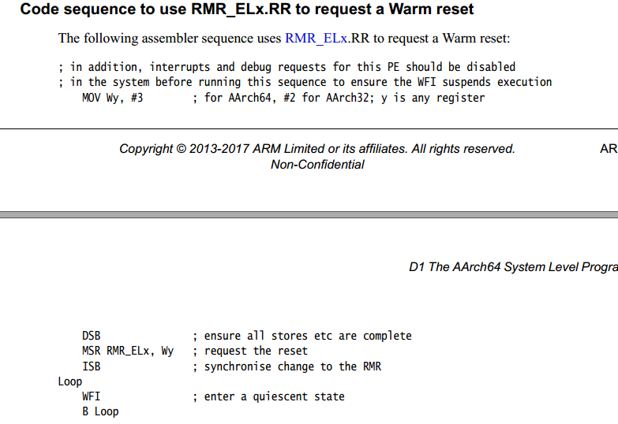
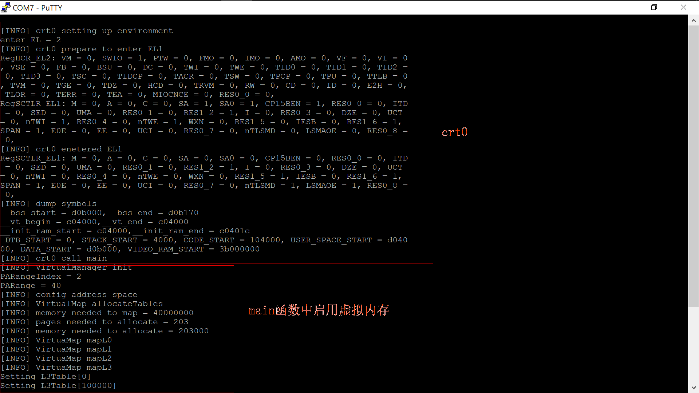
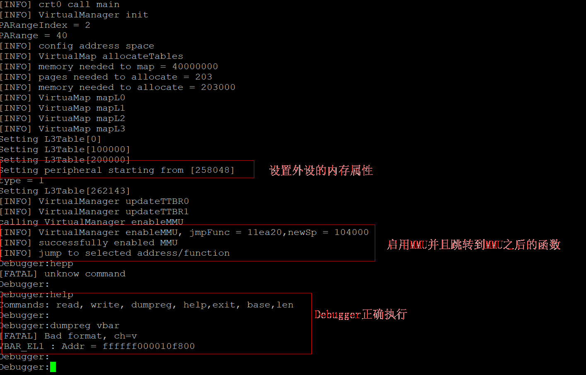
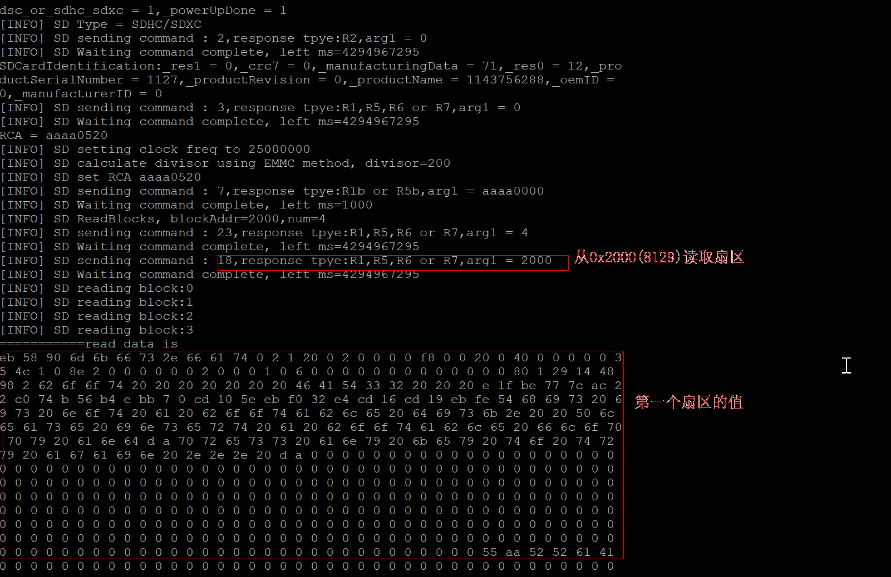
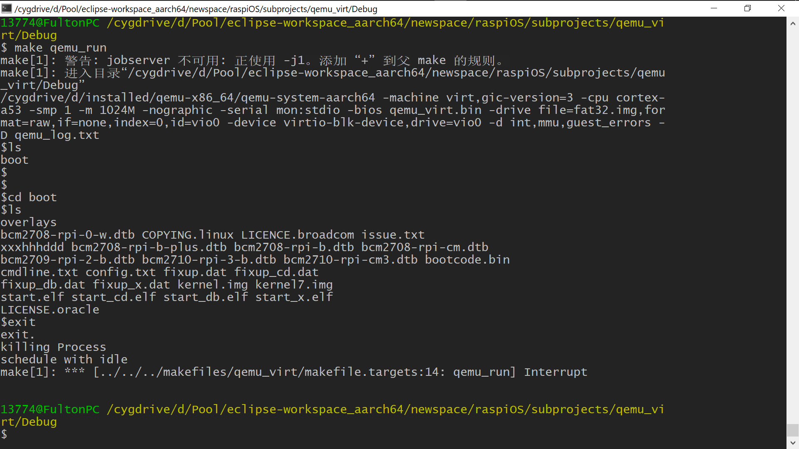
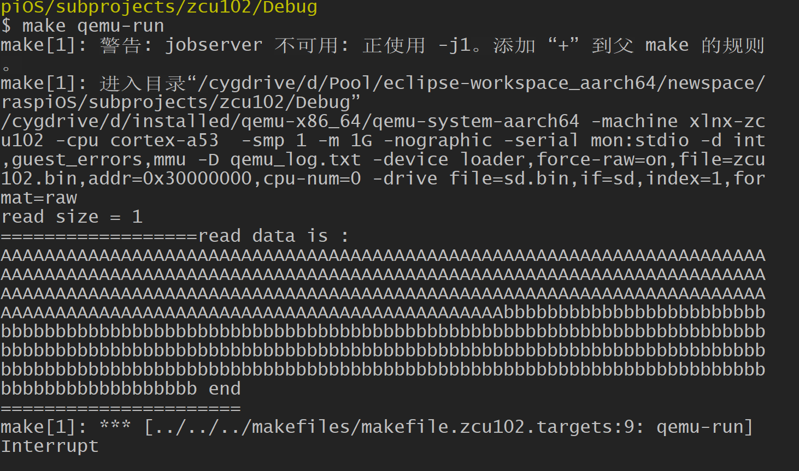

# 2018年5月20日11:19:16
【commit point】重新定义了ProcessManager的内部结构(running + readyList + blockedList + destroyedList)，新增changeActiveCatcher，确保至少有一个进程能够捕获输出。

现在bg命令能够在父进程死亡后获得输入。
# 2018年5月20日10:56:10
reinterpret_cast的基本要求：两种类型的长度相同
# 2018年5月20日00:05:42
未来内核的走向： （初级阶段）
	1.具有接受输入的能力 （yes）
	2.能够编辑内存存储到磁盘上
	3.能编译磁盘上的文件
	4.加载ELF文件

第二阶段
	提供POSIX接口

第三阶段
	移植STLPORT，即C++标准库的可移植版本

第四阶段
	用户管理

# 2018年5月19日18:52:54
【commit point】 修复QEMU下输入事件处理，树莓派上尚未测试。参见2018年5月19日18:50:34 bugfix。
# 2018年5月19日18:50:34
【bugfix】在处理输入事件时（handleIRQ），当把endInterrupt放到handleInputEvent之后时，过长的输入（34个字符以上）不能完全接收到，导致程序出现奇怪的错误。而把endInterrupt放到handleInputEvent之前，表现基本正常（虽然极少数时间出现输入不完整的情况，但是都能接收到换行符，使程序正常运行）。尚不知原因。具体参见handleIRQ函数内部的文档。
# 2018年5月19日06:44:20
【commit point】完善了进程的控制，包括参照一般的UI逻辑设计了输入转发策略；更改了输入逻辑，当进程需要输入时，它真正地进入阻塞态（通过把它放到阻塞队列中）；同时，也区分了前台和和后台的区别，新增命令bg,用于在后台执行一个程序，shell为前台执行。

一般的键盘字符获取逻辑：假设有两个交互式进程A,B，当鼠标在A时，输入转发到A；当鼠标在B时，输入转发到B。于是，可以假定有一个监视进程C，检测鼠标的每一次变化，动态地设置当前转发进程。因此，系统中存在一个唯一的转发进程。
# 2018年5月19日03:15:15
假定：当前正在运行的进程具有截取全部输入的权利。

截取输入的进程不受调度的影响，而是受特权操作影响。系统存在一个特权指令，用于将某个进程设置为输入捕获器。为了正确性，仅当该进程请求时释放数据。
# 2018年5月18日22:21:41
【commit point】演示程序进一步完善，增加了sleep命令，给与其他进程被调度的时机。修复了bug：在阻塞接收输入的过程中，IRQ启用，如果不禁用Timer，可能会调度进程，产生错误；需要保证仅仅输入中断启用。

最近的事情让我想起曲折的求职经历，现在，我认为每个人都有他自己的价值，一个公司不能随意否定某个人，仅仅依照面试的映像。有些东西，比如价值观，理想，潜在的能力，你是看不到的。
# 2018年5月18日22:14:48
关于演示程序：

设备读写，FAT文件系统： cd boot; ls  目前不支持mkdir等高级操作

虚拟文件系统  ： cd ramfs ; 一切都支持

进程： 创建 shell echo yes, shell ls;  父进程sleep 1000,将控制权交给其他进程; 子进程显示echo yes或ls的结果，然后退出； 父进程sleep完毕，继续repl程序

进程2： shell shell（创建一个新的repl进程），展示两个进程之间的各自接受输入的情况，接受输入是分别正确的


# 2018年5月18日15:36:08
【commit point】 shell命令完成，可以创建进程。现在，能用于演示的基本程序已经完成，后面，如果需求基于演示，则不会再有大的功能变化。没有实现ppid，因为没有很大必要；没有实现shutdown，reboot，因为aarch64的reset机制仍然不是十分清楚。

需要强调的是，我们在这个版本中增加了EL2，EL3的栈空间，同时ExceptionVectorEL1也能用于HVC，SMC指令，尽管最后没有用到，但是不能忽略这些努力。

# 2018年5月18日09:57:40
warm reset： 不改变调试状态
cold_reset:  全部重置
关于wfi_loop


进入quiescent(静止状态)。
# 2018年5月17日23:26:04
【commit point】shell文件管理命令--pwd,mkdir,rm,cat,cp,mv 完成。剩下：ppid，shutdown，reboot，shell。
# 2018年5月17日18:17:32
【commit point】增加了Process管理已分配内存的能力，以便能够在Process内构造一个局部内存管理器，因而内核能够提前分配内存空间，向进程传递参数。
# 2018年5月16日20:53:39
【commit point】取消了位置无关代码(-pie)编译选项，主要的调整包括了内核的生成方式、在启用虚拟内存的临界区域跳转的代码，其他的细微调整包括：Vector改用java arraylist的增长方式，Output和Input能够不再使用全局的输出设备，而是可以通过redirect来重定向，VirtualFile增加了previous指针，增加了RAMVirtualFile类。主要源代码：[main_test_int_uart_sd_mmu_process_togther_2018_5_16_vector_vfs_promoted.cpp](../src/arch/raspi3/main_test_int_uart_sd_mmu_process_togther_2018_5_16_vector_vfs_promoted.cpp)

内核生成方式：将代码分配part1和part2两个部分，part1负责最初初始化工作和启用虚拟内存，运行在低端内存；part2负责内核初始化的主要工作，运行在高端内存。融合两个部分的关键是定义一个生成代码块的大小（目前是20M），part1的代码减去这个大小一定能够获取part2的相同位置代码；其次，part1链接时基址是0，part2链接时基址是高端内存地址；在临界区域，part1将所有它已经初始化的参数传递给part2的入口函数，part2对大多数实例进行重新初始化（除了设备）。

# 2018年5月16日20:14:59
考虑带类型的指针比较，如果B是A的子类，则
B b;
A *p=&b;
(void*)p==(void*)&b?
p==&b?

【todo】 测试这一点
# 2018年5月16日14:41:15
添加了MOD_NOTE标记，用于标记当需要作出某项调整时，需要参阅的条款
# 2018年5月16日13:48:35
我对于位置无关的代码及相关的代码感到厌烦。我之前认为内核的高地址是不定的看法是错误的，实际上，对于某一个特定的架构或者硬件，它的高端地址都是可以预先配置的。

影响我重新思考的是对于虚函数表的调整这种做法，当然，本身位置无关代码的效率就要稍低一些。

在阅读了Itanium C++ ABI的部分内容后，我意识到虚表是非常麻烦的一件事情。

位置无关代码带来的麻烦：
 -  对虚表内容的重新定址
 -  所有含有指针的实例，指针必须rebase

如果我们决定不使用位置无关代码，而是内核的前面一小部分在低地址运行，剩余部分在高地址运行，就需要考虑如何编译生成这样的代码，以及在跳转的临界点，已经初始化完毕的类该怎么办。

我决定将内核编译成两部分：一部分基地址是0，另一部分基地址是0xffffff0000,两部分使用相同的代码来编译，因此可以称他们为孪生的。在启用虚拟地址之前，内核执行的是前一部分代码；在启用虚拟地址后，内核执行后一部分代码。

我们将运行的模型分成两部分：代码和数据。我们主要关注代码对数据产生的影响。

        0x0:  [代码1] -->(依赖于)  [数据1]

0xffffff0000: [代码2] -->(依赖于)  [数据2]

代码1只包含init函数引用的所有必须的函数，其他函数一律无需生成。(通过.a实现)（可选）

代码1和代码2在内存中是紧邻的，因此制作内核镜像并不困难，并且代码1临界跳转也不困难，只需要直到代码1的体积即可。

代码2中，所有的数据都认为是未初始化的（除了寄存器，外围设备），因此必须重新初始化这些数据。

UPDATE：实践表明，想要通过ar来减小生成文件的体积，这种做法是不现实的。编译器不知道真正的入口函数是什么。而其他方法代价太大。因此，我们放弃这一步。

代码1最重要的作用就在于设置虚拟内存映射表，代码1实际上可以传递许多具有特定含义的参数给代码2。包括：VirtualMap的内存位置（低端内存）。

内存管理器的节点本质上是位置无关的。

由于两部分代码都是位置相关的代码，因此它们的内存位置也必须预先设置。基于经验的原则，我们为两部分预留相同的空间，每部分20M（当前大小是13M），两部分共占据40M。

第二部分代码位于头部，第一部分代码紧邻。当第一部分执行完毕之后，其空间可以收回，但是目前我们还没有这样做。第一部分代码和第二部分代码的所看到的内存是否相同（即基地址）并不重要，因为除了虚拟内存页表之外，其他的部分都会在第二部分中重新初始化。而且我们将看到，这些代码量是有限的。

链接参数：CODE_PART=1,2 CODE_SIZE=20M

CODE_PART用于表明当前编译的是代码1还是代码2。

代码的起始是base+(2-CODE_PART)*CODE_SIZE处


# 2018年4月24日14:51:00
如何让开发变得更加简单？
1.代码没有多份拷贝 -- 这样不必考虑修改带来的问题
2.隔离不相关部分，保持相关部分   -- 这需要更加细粒度的控制。 
3.物理层和概念层的统一   -- 概念和物理之间的直接映射性质有助于
4.跨工程的refactor

概念 ： subprojects of subproject

# 2018年4月24日14:01:50
在概念上，许多地方都是相似的；然而相似性又具有不同的程度，比如，按照架构区分，不同架构之间是没有多大相似性的（我指的是具体的细节上）。
# 2018年4月24日10:49:35
一个进程可以动态选择它的输入和输出（重定向），因此最核心的是实现不同的CharacterWriter CharacterReader, 将它们作为多态基类作为到Output和Input的成员。


# 2018年4月24日00:16:14
【bugfix】 根据BCM2835手册的信息，可知mini UART不支持Receive Timeout Interrupt, 而根据16650-UART技术手册提供的信息，在FIFO启用的模式下，Receive Interrupt叫做Receive Timeout Interrupt. 因此可知mini UART不能用于输入中断。
# 2018年4月23日12:34:19
【commit point】【milestone】 此版本在修复了mmu启用后sd卡不能发送CMD8、Process新建错误以及Vector::resizeCapacity的bug之后，操作系统已经能够运行起来，真机上测试通过

源文件参见[main_test_int_uart_sd_mmu_process_togther.cpp](../src/arch/raspi3/main_test_int_uart_sd_mmu_process_togther.cpp)
# 2018年4月23日12:28:39
【bugfix】 修复了2018年4月21日18:34:06的关于ls的bug，原因在于新建进程时，错误地设置了第一部分内存的大小为0x4000(实际上应当为0x3000,即栈的大小)，这样一来，第一个页的代码属性错误地设置为可读写的，而CPU在EL1时应当拒绝执行EL0可读写的数据，因为代码应当是只读的。修复方法就是size部分将codeStart改成 codeStart-start

【bugfix】 修复了2018年4月21日18:34:06 mmu启用之后sd卡不能发送CMD8的情况，这不算是一个完成的修复，只能算是一个折中方法。因为我发现启用3级页表后mmu不能工作，但是如果是2级页表，则是正常的。因此我们将原来的3级页表修改成2级页表（而这证明也是必要的，因为L2恰好可以区分树莓派3的正常内存和外设内存）。

【bugfix】 修复了之前与reallocate相关的bug，该bug是一个typo，在Vector中，resizeCapacity时，应当传递_size而不是_size*sizeof(T),因为自上次起参数的含义已经改变。
# 2018年4月22日01:04:17
经测试，bzt的sd驱动也存在相同的问题：虚拟内存映射过后不能使用。

排除内存属性的问题，可能是总线的问题。

CMD0能够正常发送，但是任何其他命令都不能发送，CMD8总是超时，或许可以试试CMD5.
# 2018年4月21日18:44:16
【commit point】 完成了基本的用户程序，多进程调度，真机上测试通过。

注意，在此版本中，我们暂时放弃了文件系统，SD卡的IO，参见2018年4月21日18:34:06所述的两个bug。

然而，最具创造力的并不是这两个部分，因此他们可以等到将来被修复，策略就是这样的。
# 2018年4月21日18:34:06
【bug】 现在，在mmu启用之后，SDDriverV3不能发送CMD8(然而CMD0是正常发送的)， 错误状态是：1.没有Command Complete 2.发生Command Timeout错误 3.Present State中禁止CMD line

我们能想到的修复方法： 发送CMD5试试（SDIO专用），或者将其初始化为Legacy card。

【bug】 在qemu上，执行ls时，当调用用户态的内存分配函数时，发生Permission Fault,L3， 尚不清楚原因。

【bugfix】 修复了之前设置虚拟内存的错误，与TLBI指令和L3的Contiguous位有关，但是目前还不清楚与哪一个有关。 具体的参考是 http://infocenter.arm.com/help/index.jsp?topic=/com.arm.doc.den0024a/ch12s01.html

该错误曾导致：即使页表的L3映射地址是A， 实际的映射结果却是B，而且能够保证使用的页表时正确的。可能与Contiguous位有关。当全部设置为0之后可行。

【issue】 uart的输入中断触发条件至少是FIFO的1/8,这样做的后果就是输入会产生意想不到的延迟。因为区别不大，最好是每输入一个字符就触发一个中断，只要所有的字符都能正确接收。


# 2018年4月21日18:31:27
【bugfix】 修复了上一个MemoryManager中reallocate的bug，这个bug是由于newSize和oldSize的含混引起的，现在我们将其命名为newSize,oldRawSize，以表明分配后以类型大小为单位计算的数目和原始的内存大小。
# 2018年4月20日16:36:42
【bugfix】 修复了之前MemoryManager中reallocate存在的bug，原来reallocate对于析构和移动的情况没有考虑，现在，考虑到在C++下，必须进行资源的移动/销毁，因此增加了类型、已构造的大小两个参数来帮助重新分配。
# 2018年4月20日15:50:00
重构所有的代码
中断控制器不相同，基本的功能： 禁用/启用某个中断  当中断发生时，提供IRQ信息   handler处理完IRQ后调用它的endInterrupt

多层次的中断
BCM2836提供


InterruptHandler是与InterruptController相关的，前者通用，后者分用。
InterruptController和InterruptHandler之间通过InterruptContext传递信息

InterruptHandler应当在InterruptContext的环境下进行处理。

InterruptContext是一个协议。

InterruptHandler也具有层级结构
1.通用的中断，目前我们认为架构决定了InterruptHandler


# 2018年4月20日13:14:27
【commit point】 虚拟内存的启用验证成功，在真机上测试通过。
示例代码： [main_test_mmu.cpp](../src/arch/raspi3/main_test_mmu.cpp)

示例输出：


# 2018年4月20日12:52:27
【bugfix】 修复了之前设置虚拟内存属性的一个bug，该bug导致外设的属性被设置为正常的内存，从而产生bug。
# 2018年4月19日23:34:17
内存的属性
```
The shareability field is only relevant if the memory is a Normal Cacheable memory type. All Device and Normal
Non-cacheable memory regions are always treated as Outer Shareable, regardless of the translation table
shareability attributes
```
# 2018年4月19日20:38:29
关于可重定位性：
```c++
extern const char * const REG_NAME_MAP[] ;
const char *  const REG_NAME_MAP[]={
		"general",
		"vbar",
		"currentel",
};
```
const限定将其放在.text分区，extern声明其为可以重定位的，但是，REG_NAME_MAP里面的值是指针，因此REG_NAME_MAP的完整可重定位包括其内容可重定位。

通过将其定义在.relocptr分区，在mmu启用后进行重新定址即可。
```c++
extern const char * const REG_NAME_MAP[] __attribute__((section(".relocptr")));
```
链接脚本
```
	.relocptr : {
		PROVIDE(__reloc_ptr_start = .);
		*(.relocptr)
		PROVIDE(__reloc_ptr_end = . );
	} > CODE
```

# 2018年4月19日19:33:04
【commit point】 对之前的代码的整合，现在仍然保持功能正确。
# 2018年4月19日14:52:03
【commit point】 初步实现了一个可用的SD卡驱动（SD Bus模式）， 参考 [Part1_Physical_Layer_Simplified_Specification_Ver6.00.pdf](external/SDA/Part1_Physical_Layer_Simplified_Specification_Ver6.00.pdf) 和 [Host_Controller_Simplified_Specification_Ver3.00.pdf](external/SDA/Host_Controller_Simplified_Specification_Ver3.00.pdf) 真机上测试通过。

这次commit的更多信息参见`2018年4月19日00:01:49`

昨天想要commit的时间距今已经过去了13个小时，昨天编写的SD卡驱动存在的问题：只能正常执行第一次，后面的读写会卡在CMD7(选择卡的地址)这条命令上。（为了不提交有bug的驱动，我们确实花了更多时间，这值得吗？问题总是要解决的，但是以什么方式最好呢？）

首先我们总结一下昨天彼时到现在，驱动修改的部分：

 - 发送CMD8时不发送VHS=1(也就是说只有pattern=0x1AA)
 - 直接发送ACMD41而不首先获取其信息
 - sendCommand中加入延时1000ms的等待，但是注意：这里使用的wait_msec，还不是delayMS，这一点需要进一步确认
 - 设置clockFreq的过程中，加入延时等待，这一点也很重要。
 - 修改了所有的command，取消了crc和index检查。后面我们应当按照标准将它们重新正确设置。


我们调试的真实体验：
 - 插入树莓派运行第一次成功，但是第二次，第三次失败
 - 我们认为只有4次以上的读写成功，才能算测试成功

驱动成功的关键条件：
 - 明白哪些条件下发生哪些情况。
 - 针对这些情况改进
 - 延时对于真实硬件真的很重要，模拟器不能过于信任。
 - 如果可以，先找到一个正常工作的例子，将其作为base改进
 - step-by-step

这里，首先，我需要向bzt致谢，他的教程 https://github.com/bztsrc/raspi3-tutorial 是我调试成功的基础。我主要参考了 https://github.com/bztsrc/raspi3-tutorial/tree/master/0B_readsector/sd.c 。

经过这次调试，首先，我们的精力被耗费了大半； 其次，我们有所长进，认识到了需要认识的东西。经验难能可贵，但是失败的经验越少越好。

我们需要休息。
# 2018年4月19日00:01:49
(commit point取消，参见2018年4月19日14:52:03) 参考`Part1_Physical_Layer_Simplified_Specification_Ver6.00.pdf`和`PartA2_SD Host_Controller_Simplified_Specification_Ver3.00.pdf`实现了SD卡的读写驱动（SD Bus模式，非SPI模式），驱动的实现基本上按照技术手册的描述进行，除了计算clockFreq部分。读测试在真机上测试通过
测试结果如下：

boot分区的第一个扇区内容-->[test_of_boot_sector1.txt](external/SDA/test/test_of_boot_sector1.txt)

从树莓派上读取SD卡的第8192个扇区（该扇区为boot分区的第一个扇区）：


经验证，读取正确。

测试源代码 [main_raspi3_test_sd_read.cpp](../src/arch/raspi3/main_raspi3_test_sd_read.cpp)

# 2018年4月17日18:21:40
一个bug：（真机上）
```c++
	uint64_t * addr=reinterpret_cast<uint64_t*>(0x110b184);
	kout << "addr = " << addr << "\n";
	kout << "value = " << Hex(*addr) << "\n";
	while(true);
```
异常信息
```
interrupt
cpuID = 0
SYNC
RegELR_EL1: returnAddr = 10730c,
RegESR_EL1: ISS = 21, IL = 1, EC = 25,
RegFAR_EL1: faultAddr = 110b184,
```

产生数据不对齐的异常。
```
RegSCTLR_EL1: M = 0, A = 0, C = 0, SA = 0, SA0 = 0, CP15BEN = 0, RES0_0 = 0, ITD = 0, SED = 0, UMA = 0, RES0_1 = 0, RES1_2 = 1, I = 0, RES0_3 = 0, DZE = 0, UCT = 0, nTWI = 0, RES0_4 = 0, nTWE = 0, WXN = 0, RES1_5 = 1, IESB = 0, RES1_6 = 1, SPAN = 1, E0E = 0, EE = 0, UCI = 0, RES0_7 = 0, nTL
```
解决：https://stackoverflow.com/questions/37534144/armv8-alignment-abort
```
https://stackoverflow.com/questions/37534144/armv8-alignment-abort
```
# 2018年4月16日21:34:41
【commit point】 树莓派的SystemTimer在真机上测试通过，经过验证，在我所使用的板子上只有Timer1和Timer3是完全正确的，其他两个Timer能够产生中断但是没有中断状态信息。
# 2018年4月16日19:56:21
目录io的名称是不准确的，因为毕竟只有输入输出才能叫做IO。 更准确的叫法是driver.
# 2018年4月16日19:14:38
【commit point】 树莓派的UART0(PL011)输入中断在真机上测试通过。
# 2018年4月15日19:10:49
ffs是什么？查找__ffs的文档
```c++
static __inline__ int ffs(int x)
{
	return x ? (__ffs((unsigned long)x) + 1) : 0;
}
```
# 2018年4月15日17:09:08
关于BCM2837， 继承自BCM2836
BCM2836
The ARM cores run at 1.2GHz, making the device about 50% faster than the Raspberry Pi 2. The VideoCore IV runs at 400MHz.
# 2018年4月15日17:08:49
【提议】 null_abort可以使用指针传递
# 2018年4月15日14:33:30
【提议】 可以使用Delim这样的参数来获得更好的可变参数传递：
原来是这样的：
```c++
	template <class ... Args>
	GICDistributor(Args && ... args)
		:MemBasedRegReader(std::forward<Args>(args)...)
	{}
```
改成：
```c++
	template <class ... Args,class ... OtherArgs>
	GICDistributor(Args && ... args,Delim d,OtherArgs && ... otherargs)
		:MemBasedRegReader(std::forward<Args>(args)...),
		Other(std::forward<OtherArgs>(otherargs)...)
	{}
	// or
	template <class ... Args,class Delim,class ... OtherArgs>
	GICDistributor(Args && ... args,Delim d,OtherArgs && ... otherargs)
		:MemBasedRegReader(std::forward<Args>(args)...),
		Other(std::forward<OtherArgs>(otherargs)...)
	{}
```
# 2018年4月15日12:43:00
经过测试，树莓派3开机处于EL2，因此它处于非安全状态。
# 2018年4月15日02:30:03
【commit point】 raspi3的mini uart驱动编写完成，连接树莓派3能够正确输出。

raspi3和qemu_virt共用的是同一个ld文件，未来的目标是使所有的aarch架构使用同一个ld文件。

此外，raspi3的crt0也能使用qemu_virt的crt0.未来的目标是共用一个crt0.

还规定了对树莓派config.txt的更新，必须进行注释，注释要求见其中的例子。


注意：连接树莓派时，TTL接口的TXD应当与树莓派的RXD相连，即接受口与传输口对联。
注意： 发送速率过快还可能对称windows蓝屏，虽然不知道为什么。
【todo】 不遗余力地将此项目更加优化。
# 2018-4-14 16:24:07
【todo】 将m_abort修改成null_abort
【todo】 修复bug： 在main_mmu_set中，__stack_top已经是高端地址，这是由于其-fpie编译的原因。
所有的extern我们都可以理解为offset，偏移。 在代码中用到的extern都是偏移，偏移基本上是不变的。
【todo】 fatentry两个变量使用new。
# 2018年4月14日16:13:17
【commit point】 现在系统能够从EL3启动，并且切换到non-secure EL1. 代码[crt0_EL3](../src/arch/qemu_virt/crt0_EL3.cpp)

从EL1模式调整到EL3模式是一个痛苦的过程，尽管最后代码的调整很少。

回顾之前的代码，能够工作在：非安全 的EL1， 配置中断为IRQ进入。

而从EL3启动之后，要切换到EL1，需要：1.设置SCR_EL3  2.设置HCR_EL2  3.在EL3设置Distributor的igroup
# 2018年4月14日13:47:18
注:在非安全状态不能访问的寄存器
GICD_IGROUPR<n>
GICD_IGRPMODR<n>
GICD_NSACR<n>
GICR_IGROUPR0
GICR_IGRPMODR0
# 2018年4月14日12:45:09
终于解决了在non-secure EL1下的组配置问题， Distributor必须在EL3时配置为 igroup=1,igroupmode=0, 此时配置才是有效的。

参考了linux的irqchip gicv3的代码，主要是更改了中断初始化的顺序，以及增加对RWP位的检测。
当group禁用时，甚至不会看到pending状态。

这样一来，必须在EL3时完成interrupt的配置，主要是将中断id分配到non-secure group1组，启用系统寄存器。
概念性的代码
```c++
// bl to
static int InterruptManager::preconfigEL3() // applies only when EL=3
{
	// SRE at EL3,EL2
	// enable group 1 NS
	// 
}
static void changeToEL1(void * addr,bool spsel)
{
	// determine current el
	// sp keeps the same, sp_el1 or sp_el0
	// elr_elx = addr
	// spsr_elx =0x3cZ , Z=0101 or 0100
}
```
# 2018年4月14日02:37:15
Secure Group 1 interrupts are treated as Group 0 by a CPU interface if:
— The PE does not implement EL3.
— ICC_SRE_EL1(S).SRE == 0

只有secure下的secure group1 作为IRQ通知，而配置为secure group1 需要1:groupmode=1,
groupstatus=0


At start-up, and after a reset, a PE can use this register to discover which peripheral INTIDs the GIC supports. If
GICD_CTLR.DS==0 in a system that supports EL3, the PE must do this for the Secure view of the available
interrupts, and Non-secure software running on the PE must do this discovery after the Secure software has
configured interrupts as Group 0/Secure Group 1 and Non-secure Group 1


关于不能正确配置aarch64的FIQ和IRQ，我认为这是qemu的bug。
目前，我们使用FIQ来处理输入中断。因为目前QEMU通过FIQ报告的中断号是1023,简直就是胡扯。

然而不应当有任何假定。  因此，还是回归树莓派吧！这个bug暂时记下来，以后再说吧。
# 2018年4月13日22:02:50
qemu设置pc的起始地址

qemu是将dtb文件存放在RAM的开始处，而将加载的代码放置到RAM+0x8000处 （这是基于virt得出的结果）

但是注意，偏移不一定是0x8000, 当提示
```
rom: requested regions overlap (rom qemu_virt.bin. free=0x0000000040010000, addr=0x0000000040008000)
```
依次增加其值，比如0x50000000, 什么时候可以就是取那个值。

而Debug时，停止地址尝试停放在 BASE + 0x4上，因为BASE上可能停不下来。

当使用下面版本的qemu运行时，有一个已知的bug:不能设置cpu-num=0的addr，这是代码上的bug。
```
QEMU emulator version 2.11.0 (v2.11.0-11693-g21057c841e-dirty)
Copyright (c) 2003-2017 Fabrice Bellard and the QEMU Project developers
```
该bug在2018年2月05日，linaro的修复中提及：https://patches.linaro.org/patch/126903/
希望在下个版本的qemu中它已经修复。（UDPATE：在最新版本的qemu中已经修复，因此请保持qemu最新版本）
```
 -device loader,file=qemu_virt.bin,addr=0x50000000,cpu-num=0,force-raw=on
```

我们可以按照下面的方式启动kernel，并且保持在非安全状态：

当使用secure=on时， -bios指定的文件内容会变成dtb中secflash/secram的一部分。而我们需要避免使用安全区域。

--- 使用新版本qemu，代码的调整
1.查找dtb的大小，按4KB对齐保留这部分   -- 经过测定，dtb大小约等于0x2000, 因此保留0x4000的空间即可
2.栈的变化： 大小仍然不变，基址向上调整  -- 
3.将BIOS命名为ROM， 基址调整
4.将KERNEL_ADDR调整为ROM_BASE
5.在地址映射时，ROM_BASE,ROM_SIZE这部分设置为只读。
6.设置0~RAM_BASE为未映射。
7.重新解析dts文件，查看各个外设的基地址。   -- 外设地址不变，增加secram,secflash. secram为 0xe000000 +0x1000000
8.命名改变： 主要的内存布局命名：DTB STACK CODE DATA ， ld脚本提供的变量要么是小写+下划线(如user_space_size), 要么是大写加下划线。
9.pl011的intid的变化

# 2018年4月13日22:02:40
[关于环境变量]
windows下不区分大小写， linux区分
PROVIDER专节：
PROVIDER使用命令：${COMMAND} ${FLAGS} -E -P -v -dD "${INPUTS}" 来发现include路径和宏定义， 在cross环境下，COMMAND带有前缀。 但是，PROVIDER使用的是windows路径方式，因此应当修改成：${TOOLCHAIN_ROOT_windows}/${COMMAND}

# 2018年4月13日14:08:04
关于eclipse生成makefile中的编译器名称： 只包含prefix，不包含路径。 需要手动将路径加入到PATH的前部。
# 2018年4月13日03:01:19
然而执着是有代价的，正如我们现在所做的一样。 针对多个目标是困难的。

只要组件之间以某种形式工作良好就可以了。

QEMU： 仅有EL1和EL0，工作良好

也许可以从Linux的调试中找到灵感

也许最终的结果是：所有的代码加载到RAM中执行。

// 使用二进制格式的SystemFeatures
概念性的展示：
选择处理器
```c++
if (PROCESSOR_NUM >= 2)//use 1
	selectRunning=1
else
	selectRunning=0
```

QEMU加载到指定地址： -smp 4  -device loader,addr=ADDR,cpu-num=1

# 2018年4月12日23:13:38
SCTLR_EL1.nTWI和nTWF 决定EL0是否能够访问WFI,WFE
# 2018年4月12日22:12:37
?:语法
```c++
a= b?:1;
```
# 2018年4月12日20:40:37
[异常级别的影响]
寄存器的访问，寄存器的使用。

EL1下， 不同的配置，当前系统要求：
1.非安全状态
2.所有在EL1的访问没有trap

执行状态： EL0由PSTATE.nRW决定， EL1由HCR_EL2.RW决定，EL2由SCR_EL3.RW决定

安全和非安全空间：ID_AA64MMFR0_EL1的SNSMem域决定了是否能够区分Secure和Non-Secure两个空间。如果从Secure EL3切换到Non-Secure EL1,则EL3能够访问内存在EL1访问就会失败。
比如：
```
0x0:    adr x0,2f
0x4:    msr elr_el3,x0
0x8:    eret
0xc     2:
0xf:    nop
```
由于0xf属于安全空间，因此在切换到EL1之后，对0xf的访问将会报external sync abort.

从另一个侧面来看，BIOS确实属于secure space。

我们将会作出一个改变：内核运行在安全空间。


# 2018年4月12日18:02:58
【milestone】【commit point】 完成了Input和inputBuffer,使用Queue实现。该版本完成了一些基本的用户态功能，内核态的代码基本编写完成。代码参见[内核初始化 main_demo_complete_input.cpp](../src/arch/qemu_virt/main_demo_complete_input.cpp)和 [用户态例程 user_main_demo_repl.cpp](../src/arch/user_space/user_main_demo_repl.cpp)

运行示例

[video](commits/2018-4-12_17_57_41_when_almost_done_user_space.mp4)

# 2018年4月12日16:21:16
[系统调用：输入请求]设计
系统调用形式：用户请求填充至多n个输入字符到data指定的区域，并且当输入中有换行符时是否标记本次输入结束，返回实际填充的字符数。
注意：字符时16位的，因为需要高8位来确定输入一个字符时是否有控制键的产生。
额外有两种模式：阻塞式和非阻塞式

阻塞式：   请求直到输入的条件满足。
阻塞至多n秒： 
非阻塞式： 请求输入立即返回

# 2018年4月12日15:31:58
hw/arm/virt.c的 irqmap定义
```c
static const int a15irqmap[] = {
    [VIRT_UART] = 1,
    [VIRT_RTC] = 2,
    [VIRT_PCIE] = 3, /* ... to 6 */
    [VIRT_GPIO] = 7,
    [VIRT_SECURE_UART] = 8,
    [VIRT_MMIO] = 16, /* ...to 16 + NUM_VIRTIO_TRANSPORTS - 1 */
    [VIRT_GIC_V2M] = 48, /* ...to 48 + NUM_GICV2M_SPIS - 1 */
    [VIRT_PLATFORM_BUS] = 112, /* ...to 112 + PLATFORM_BUS_NUM_IRQS -1 */
};
```
# 2018年4月12日13:48:00
关于移动构造和析构函数应当完成的功能，实际上是需要完成资源回收和移动的功能，参见下面的代码
```c++
template <class T>
Queue<T>::Queue(Queue &&rhs)
:_data(rhs._data),
 _len(rhs._len),
 _curLen(rhs._curLen),
 _indexAdd(rhs._indexAdd),
 _indexRemove(rhs._indexRemove)
{
	rhs._data=nullptr;
}
template <class T>
Queue<T>::~Queue()
{
	if(_data)
	{
		delete [] _data;
		_data=nullptr;
	}
}
```
根据上面所说的原则，只需要针对资源进行管理即可， 而这里代表资源状态的只有_data.
# 2018年4月11日22:54:45
找到一个bug： virtio的descrNum随着使用的增加，不会减少。
update: 2018年4月12日12:37:03  经过调试QEMU的源码，发现vq.inuse也会减少。并不是总是保持增加。其中的原因不得而知，但是已经确认这不是一个很严格的bug。只要设置descrNum尽量大即可，它是可重用的。
# 2018年4月11日22:54:19
修复了allocate的一个bug： n=0时直接返回nullptr
# 2018年4月11日16:09:13
在4月13日13:00之前，不要再修改此项目。此期间休息。
【todo】 增加用户态的foreach遍历函数。
# 2018年4月11日16:02:37
【commit point】 重构了Vector和String，增加UniversalVector和UniversalString两个类，用于支持内核态和用户态之间的内存管理交互。参见[内核态初始化 main_demo_universal_init_kernel_with_VirtualFileSystem.cpp](../src/arch/qemu_virt/main_demo_universal_init_kernel_with_VirtualFileSystem.cpp)和 [用户态例程 user_main_demo_vfs_proxy.cpp](../src/arch/user_space/user_main_demo_vfs_proxy.cpp)
此外，由于代码体积的膨胀，将UserSpace的代码空间从5*4K调整到7*4K。

每到commit的时间，我们似乎显得很轻松，这时候，贝多芬的第九交响曲的最后一节应当被用作庆贺！
# 2018年4月11日15:59:18
花了很多时间重构Vector，使其能够跨越内核态和用户态的使用，同时考虑多数情况下使用的是全局内存分配器的情况。
使用新的UniversalVector和UniversalString重写了过去那些古怪的用法（那种用法如果不被解决，就会像病毒一样扩散下去）
但是作为代价，就是代码的体积增大了。

目前为止，我们为此项目花费了很多心血，我甚至要病了。
这样的情况不能持续下去。
那么，休息几天吧！
# 2018年4月11日04:50:34
【commit point】 正确实现了用户态的ls,cd命令，采用的方法(workaround)虽不优雅但是却工作良好。此版本修复了大量bug，系统能够支持多重同步中断。示例文件参见 [内核态初始化 main_demo_universal_init_kernel_with_VirtualFileSystem.cpp](../src/arch/qemu_virt/main_demo_universal_init_kernel_with_VirtualFileSystem.cpp)和 [用户态例程 user_main_demo_vfs_proxy.cpp](../src/arch/user_space/user_main_demo_vfs_proxy.cpp)
# 2018年4月11日03:12:20
【todo】 了解expresson sfinae
参见https://stackoverflow.com/questions/13786482/detect-if-a-default-constructor-exists-at-compile-time
如何实现default函数检查。
```c++
template<typename T>
class is_default_constructible {

    typedef char yes;
    typedef struct { char arr[2]; } no;

    template<typename U>
    static decltype(U(), yes()) test(int);

    template<typename>
    static no test(...);

public:

    static constexpr bool value = sizeof(test<T>(0)) == sizeof(yes);
};
```

# 2018年4月11日02:52:45
【bugfix】 修复了Vector的初始化和pushBack，区分已分配和已初始化两个过程。
# 2018年4月11日01:58:40
关于成员指针
```c++
// expre_Expressions_with_Pointer_Member_Operators.cpp  
// compile with: /EHsc  
#include <iostream>  
  
using namespace std;  
  
class Testpm {  
public:  
   void m_func1() { cout << "m_func1\n"; }  
   int m_num;  
};  
  
// Define derived types pmfn and pmd.  
// These types are pointers to members m_func1() and  
// m_num, respectively.  
void (Testpm::*pmfn)() = &Testpm::m_func1;  
int Testpm::*pmd = &Testpm::m_num;  
  
int main() {  
   Testpm ATestpm;  
   Testpm *pTestpm = new Testpm;  
  
// Access the member function  
   (ATestpm.*pmfn)();  
   (pTestpm->*pmfn)();   // Parentheses required since * binds  
                        // less tightly than the function call.  
  
// Access the member data  
   ATestpm.*pmd = 1;  
   pTestpm->*pmd = 2;  
  
   cout  << ATestpm.*pmd << endl  
         << pTestpm->*pmd << endl;  
   delete pTestpm;  
}  
```
需要理解的一点就是：把A::类型的指针当做偏移值即可。

# 2018年4月11日00:31:17
将当前目录reset --hard到上一个commit，不再考虑Vector支持自定义memoryManager。

我想，经过这次重构后，以后对待修改，我们会更加谨慎和保守。
# 2018年4月11日00:25:53
【todo】 修改，使系统能够在EL1时再次进入同步中断，这是系统调用的关键。
主要是需要存储： 从EL1进入EL1时，栈指针不需要保存；SPSR不需要保存，需要保存的就是SPSR, 
中断进入设置的寄存器： PSTATE --> SPSR, PC --> ELR , ESR,FAR,
中断返回设置的寄存器： SPSR-->PSTATE,    ELR-->PC 

下面用sync指代同步异常

模型： 栈模型
在某些区域，不允许sync发生， 用一个变量： sync表明
当不允许sync发生，但是却再次进入了sync时，表明存在错误。
_allowSyncExcep


注：目的是为了用户态能够传递函数得到执行，因为这些函数里面可能包含系统调用。

# 2018年4月11日00:20:49（该时间段产生的工程修改被重置）
修复了strlen
```c++
size_t strlen(const char *src)
{
	const char *p=src;
	while(*p++);
	return (p-src-1); // old: return(p-src)
}
修复了 abort noreturn的属性
# 2018年4月10日18:36:13（该时间段产生的工程修改被重置）
在内核态和用户态之间不应当传递对象，而应当传递对象的函数。
因为，内核编译时产生的方法的偏移和用户态不一样。
比如，下面的函数期望输入是一个用户态的vector，希望调用pushBack时调用的是用户态的相应函数，然而由于是在内核环境下，所以pushBack函数实际调用的是内核的函数。
```c++
// 内核态的处理函数
void findPath(Vector<String> & res)
{
	...
	res.pushBack("..."); // 希望使用用户态的pushBack，但实际上编译产生的是内核态的偏移。
	...
}
```

只能说，这种设计十分naive。

原则： 在内核态和用户态之间，传递函数，并且函数的参数不能含有复杂的对象。（必须含有trivial可构造的对象）。

函数能够传递必须保证：函数内部没有与内核态/用户态相关的使用， 调用的函数也没有内核态/用户态相关的使用。
定义这样的函数为：通用函数。

如果一个对象的所有函数是通用的，则这个对象是通用的。


将一个对象改写成通用对象的过程：  
使用模板参数<bool universal>
将所有的全局变量使用 指针替换： A [universal?1:0]  -- 使用c++允许的0大小的数组特性

下面展示了一个例子：
```c++
#include <iostream>

template <bool universal>
class V{
public:
		V()
		{
			static_assert(universal,"");
		}
		V(std::ostream &o)
			{
			    static_assert(!universal,"");
				_out[0]=&o;
			}
		std::ostream   &getOut();
private:
		std::ostream*   _out[universal?0:1];// error: ISO C++ forbids zero-size array [-Wpedantic]
};

template <bool universal>
std::ostream  & V<universal>::getOut()
{
        return std::cout;
}
template <>
std::ostream  & V<false>::getOut()
{
        return *_out[0];
}

int main()
{
        V<false> v1(std::cout);
        v1.getOut() << "v1\n";
        V<true>  v2;
        v2.getOut() << "v2\n";
        std::cout << "sizeof(v1) = " << sizeof(v1) << "\n";
        std::cout << "sizeof(v2) = " << sizeof(v2) << "\n";
}
```
注意： 在没有特化的情况下，期望调用的方法应当使用static_assert 

注意：如果报错：ISO C++不允许使用长度为0的数组，则使用下面的设计模式替代：
```c++
class MemoryManagerWrapper{
public:
	static_assert(universal,"");
	AS_MACRO MemoryManager & getMemMan() { return mman;}
};
template <>
class MemoryManagerWrapper<false>{
public:
	MemoryManagerWrapper(MemoryManager &mman):_mman(&mman){}
	AS_MACRO MemoryManager & getMemMan() { return *_mman;}
	MemoryManager *_mman;
};
```
# 2018年4月10日13:47:51
【commit point】 修复了vtables, virtio的bug，更新了用户态文件系统。参见
这非常重要，参见[内核态初始化 main_demo_universal_init_kernel_with_VirtualFileSystem.cpp](../src/arch/qemu_virt/main_demo_universal_init_kernel_with_VirtualFileSystem.cpp)和[用户态例程 user_main_demo_vfs_proxy.cpp](../src/arch/user_space/user_main_demo_vfs_proxy.cpp)
此版本包括很多bug修复： 1.vtables的重定位  2.virtio使用DMA地址而不是虚拟地址  3.重构了VirtualMap

ps：经过连续两天的奋战，终于理解和找到了virtio的bug。
# 2018年4月10日13:37:02
【acknowledged】 查询IntID=79是什么中断，该中断在系统中持续发生。
# 2018年4月10日12:39:52
【bugfix】 在scheduleNext中，当直接使用current时，使用return而不是restoreXXX
# 2018年4月10日12:36:26
【todo】所有的init可用等价的构造函数替代。
所谓的资源获取即初始化，十分重要。
# 2018年4月10日11:34:52
遇见了一个虚拟内存启用之后的virtio的bug，现在已经弄清楚了： 外设使用的DMA地址是物理地址，并不是虚拟地址。因此在设置外设的地址相关的寄存器时，应当转换成物理地址。

这就对legacy 的 virtio有一个限制：实际的内存地址不能高于32位。

而原来的设想的内核能够拥有一段低地址空间也就作罢。
# 2018年4月10日00:03:40
未做笔记
# 2018年4月9日19:36:44
关于virtualbox不能创建软链接的解决方案。
https://serverfault.com/questions/476610/virtualbox-issue-with-symlinks-in-shared-folders
# 2018年4月9日18:12:42
virtio 的32位PFN的限制
https://github.com/TheNewNormal/libxhyve/blob/master/include/xhyve/virtio.h

为了在内核空间使用vio，需要一些内核可专门访问的低端地址。
包括：起始，大小。
大小必须为4KB的数倍。
将RAM的一部分映射到那里。

所有的进程必须保留这些项。

参数n, va, pa
改变：1.初始化内核过程中，  将TTBR1的内存的pa对应的高端n个页的项置为无效
     2.新建一个低端内核内存管理器，用于这片区域。
	 3.对于每一个新建的进程，总是将va指定的连续n项映射到实际ram的相应位置。


# 2018年4月9日11:40:21
测试vtable
ld文件：vt.ld
```
MEMORY{
        BIOS(rx) : ORIGIN = 1K, LENGTH = 8K
        RAM(rwx) : ORIGIN = 10K, LENGTH = 8K
}
SECTIONS{

        .text : {
         *(.text)
         *(.text.*)
         PROVIDE( __vt_rom_begin = .);
        } > BIOS

		/* 产生vtable的数据 */
        .vtables : AT(__vt_rom_begin){
        PROVIDE( __vt_begin = . );
         *(.rodata._ZTV*)
        PROVIDE( __vt_end = . );
        } > RAM
        .rodata __vt_rom_begin + SIZEOF(.vtables):{
                PROVIDE( __vt_rom_end = . );
                QUAD(SIZEOF(.vtables)); /* .vtable的大小*/
                QUAD(__vt_end - __vt_begin);
                QUAD(LOADADDR(.vtables));
                QUAD(__vt_rom_begin);
                QUAD(__vt_rom_end);
                QUAD(__vt_begin);
                QUAD(__vt_end);
                *(.rodata)
                *(.rodata.*)
        } > BIOS

}

```
源文件：vt.cpp
```c++
void operator delete(void*, unsigned long)
{

}
class Base{
        public:
                virtual ~Base()=default;
                virtual void print()
                {
                        auto p="Base\n";
                }
};

class Son:public Base{
        public:
                virtual ~Son()=default;
                virtual void print()override
                {
                        auto p= "Son\n";
                }
};

int main()
{
        Son s;
        Base *p=&s;
        p->print();
}
```
编译：`aarch64-elf-g++ vt.cpp -c -o vt.o -fno-exceptions -fno-rtti`

链接：` aarch64-elf-g++ -nostdlib -Xlinker -Tvt.ld vt.o  -o vt.elf`

objcopy：` aarch64-elf-objcopy.exe vt.elf -O binary vt.elf vt.img`

dump : `aarch64-elf-objdump.exe -D vt.elf |less`
# 2018年4月9日10:07:49
vtable模型
virtual ptr : p
*p --> vtable 基地址
p->method() :  Func *f = *p+ offset(method),  (*f)(...)
虚指针p存储的是其vtable的基地址， 每个类型的指针存储各自类型的vtable基地址。

一个实例： 基地址：0x1bfb0  


# 2018年4月9日01:52:34
【todo】 实现高效的memcpy,memset
# 2018年4月9日01:46:28
【milestone】【commit point】 编写了VirtualFileSystem和FAT32VirtualFile，添加了虚拟文件系统，用于支持不同的文件系统共存
这非常重要，参见[main_demo_VirtualFileSystem.cpp](../src/arch/qemu_virt/main_demo_VirtualFileSystem.cpp)

VirtualFileSystem这一设计是如此的精妙以致于我都为其叹服了！
因为它的引入解决之前许多冗余的设计，而且实践显示了这种设计的简洁和精练。

Powerful Design！
# 2018年4月9日01:40:22
【todo】 添加VirtualFileSystem的说明，并注释其中思想的精妙之处。（懒惰加载等）
# 2018年4月8日23:52:43
【todo】 处理错误和异常。 在内存分配错误时，如果不能恢复，报告系统。 使用异常处理。
# 2018年4月8日18:38:52
【bugfix】 修复了virtio 的驱动中，读取和写入的问题，这是一个异步模型，在单线程的环境中必须添加同步或者等待操作。
现在通过usedRing的old_idx和new_idx来判断是否有完成的idx，以此判断是否完成读取。
因此，读取从本质上来说是blocked的。

该问题再次启发我们，所有曾经考虑过的问题，最好在当时就解决，不要做任何后来的假定。
因为我们曾经就该问题做过假定，而现在发现由于读请求过快可能导致上述问题。
# 2018年4月8日18:27:20
深入理解FAT

FAT的两个主要部分是： FAT表和Data区域
FAT表的每个项（FAT32的表项大小为32位）对应于Data区域的每个簇（簇的大小由bpb决定）

根目录是一个簇链表，但是根目录没有大小，其大小应当由第一个全0的DirEntry确定。
根目录所指向的所有簇的内容组成了一个DirEntry表，正如上面说的，表的大小由最后一个簇的第一个全0项确定。因为根目录没有指定字节数目。

根目录中的每一DirEntry项，反过来，有一个起始簇号，决定了一个簇链表；有一个size域，决定了总共的字节大小（实际读取的字节数目由size域与簇数目决定的大小中的最小值决定）； 有一个attr域，决定该项是一个目录、文件还是其他特殊类型。
注：需要size域的原因是，簇只能基于簇大小来确定文件的大小，而size能够在字节粒度上确定文件大小。


# 2018年4月8日14:09:54
【todo】 重新编写vector的参数传递，使其能够支持引用和值两种方式，并且能够做出自动选择（当没有明确指定时）
# 2018年4月8日13:47:59
重构内存管理器和Vector完成。
# 2018年4月8日09:48:22
【acknowledged】 "Virtqueue size exceeded"的错误
在virtio的读写中，如果描述符的数量不足，而一段时间内系统处于读状态availRing足够多，则会产生ring数量不足的情况，从而导致virtio读写错误。

解决方案：增加descrNum的数量（推荐）
或者等待。
# 2018年4月8日09:14:31
错误：undefined reference to `__cxa_pure_virtual'
参见
https://stackoverflow.com/questions/920500/what-is-the-purpose-of-cxa-pure-virtual

原因：虚函数不能在构造函数以及析构函数中调用，如果这样的调用发生了，就会调用__cxa_pure_virtual来报告这个错误。

库的开发者应当提供自己的__cxa_pure_virtual函数。
extern "C" void __cxa_pure_virtual() { while (1); }
# 2018年4月7日22:07:30
实际上，正是那些demo构成了整个库的基础价值：它的示例用法。
# 2018年4月7日21:23:21
用户态程序的建立：
输入输出： echo
文件系统的管理：pwd,ls,cd,cat,mkdir,rm,rmdir
计算机管理： shutdown,reboot
进程管理：   pid,ppid,exit

对文件系统的管理需要建立路径模型。有一个根目录/，该根目录下有不同的文件系统。该模型很简单：在开机过程中检测挂载的sd卡（如果是qemu，检测virtio的块设备），然后将其挂载到根目录下。

因此，根文件系统的责任就是映射目录和设备。

根文件系统适合使用树结构实现，每个节点是一个通用的文件系统节点，然而这是一个多态节点，意味着它可以更加细化为其他类型。(static_cast)

节点的通用属性： 节点类型，节点的名称
FAT根节点：代表的是一个FAT文件系统管理器。

FAT文件系统管理器：包括一个实例化的ByteReader, 实现read,write,createDir,createFile等操作。

初始化过程：预定义的块设备通过FAT文件系统管理器加载到根目录下，目录名称为FAT卷的名称。


# 2018年4月7日20:32:16
借助设置和初始化两个过程在概念上的分开，我们可以在启用MMU之后完整地重新设置类的基地址而不用调用其初始化过程。
因此分开这两个过程是有益的。

当然，我们也可以附加参数指定是否在构造函数中进行初始化，而这种特殊的情况用于MemoryManager比较实用。
# 2018年4月7日18:49:26
【commit point】重构了虚拟内存组织架构。这一版本的示例代码可以参加[main_demo_universal_init_kernel.cpp](../src/arch/qemu_virt/main_demo_universal_init_kernel.cpp)
# 2018年4月6日12:32:02
重用是最本质的东西，而重用的形式可能各不相同。
# 2018年4月5日22:06:23
【commit point】 通用计时器完成，产生定时中断。

下一步进行多进程的运行。
# 2018年4月5日22:04:22
我们将之前一直使用的验证代码组织重新进行一次说明：
验证代码名称为main_XXX.cpp
首部含有注释，注释表明它完成的功能。

由于一个版本的依赖的代码在下个版本可能改变，因此能够契合上下文展示源程序的唯一方法就是通过git的commit history来回顾。
# 2018年4月5日19:36:30
【acknowledged】 uint32_t和uint32_t相乘，返回uint64_t
```c++
#include <iostream>
#include <cstdint>

uint64_t mul(uint32_t a,uint32_t b)
{
        return a*b;
}
int main()
{
        uint32_t freq=625000000;
        uint32_t ms=100;
        std::cout << static_cast<uint64_t>(freq)*ms/1000 <<std::endl;
        std::cout << freq*ms/1000 <<std::endl;
        std::cout << mul(freq,ms)/1000 <<std::endl;

}
```
输出
```
62500000
2370457
2370457
```
问题在于相乘的方式。
# 2018年4月5日16:07:49
修复了一个CNTPCT_EL0的读问题：需要ISB。参见ARMv8 profile,D8.2.1
# 2018年4月5日13:40:27
【commit point】 中断系统重构完成，SGI测试成功。
# 2018年4月5日13:37:34
【acknowledged】 在GIC Distributor中，下面的代码设置启用中断位
```c++
// enable all interrupts
auto en=RegGICD_ISENABLER::make(0xFFFFFFFF);
for(size_t i=0;i!=32;++i)
	en.write(regPtr(isenabler+i*4));

RegGICD_ISENABLER::read(regPtr(isenabler)).dump(); // 全0
RegGICD_ISENABLER::read(regPtr(isenabler+4)).dump(); // 全1
```
上面的代码说明，sgi和ppi只能通过GIC Redistributor来设置。

上下文： aarch64， 没有EL2,EL3, 非安全状态。

# 2018年4月5日12:06:33
【todo】Process.h 旧的vmsa_descriptor.h
# 2018年4月5日11:04:32
volatile是件麻烦事。
```c++
AS_MACRO static {name} read(void* addr)
{{
    return *reinterpret_cast<{name}*>(addr); 
}}
AS_MACRO static {name}& update(void* addr)
{{
    return *this=*reinterpret_cast<{name}*>(addr); 
}}
AS_MACRO static {name}& update(volatile void* addr)
{{ 
    *reinterpret_cast<{scale_type}*>(this)=(addr)*reinterpret_cast<volatile {scale_type}*>(addr);
    return *this;
}}
AS_MACRO static {name} read(volatile void* addr)
{{
	{scale_type} res=*reinterpret_cast<volatile {scale_type}*>(addr);
    return *reinterpret_cast<{name}*>(&res); 
}}
```
# 2018年4月4日23:25:01
【acknowledged】 在内存映射的寄存器中，gic的Redistributor必须使用完整的32位读写，也就是说ldrb 指令读写会引起错误：
```
gicv3_redist_read: invalid guest read at offset 0000000000000014size 1
```
解决方法就是引入 mode 的区别，mode=in-place, mode=out-place两种。
典型代表是内存映射寄存器和系统寄存器。
# 2018年4月4日20:31:30
【mark】 完善了基于位的定义。调整了qemu_virt工程，现在能够编译通过。
# 2018年4月4日20:17:23
【acknowledged】c++中，不要返回volatile值(copy,read)，但是可以返回volatile引用
```c++
volatile int read()
{
	return ...;
}
```
# 2018年4月4日11:29:16
【acknowledged】c++的符号空间冲突法则
```c++
#include <cstdint>
class AC{
public:
        // 类型名不能与类型名冲突，域名不能与域名冲突。
    enum A{
        N //A则与uint32_t A:1冲突
    };
    uint32_t A:1;
    uint32_t RES:31;

}__attribute__((packed));
#include <iostream>
int main()
{
        AC AC;
        std::cout << AC.A<<"\n";
}
```
# 2018年4月4日09:44:18
关于InterruptManager, 它已经耗费了我们过多的时间了，而这是因为找不到它的应用场景所致。
整个GIC的配置过程如下： 初始化
# 2018年4月4日09:42:49
我们提供了flattenList的一种新思路：
```python3
["RegGICD_ICFGR","uint32_t",[["RES0",1, "cfg"+str(i//4),1][i%4] for i in range(0,64)]]
```
# 2018年4月3日23:04:00
虽然两个系统寄存器读取的名称不同，但是它们的域完全相同（它们的意义也是完全相同的），这种情况下，应当将它们视为同一类。视为同一类的好处是能够通过数组对它们进行统一的操作。
比如对于ICC_EOIR0_EL1和ICC_EOIR1_EL1。

一个可能的实现是使用它们的scale_type进行存储，然后通过数组下标进行强制转换。
```c++
class UseSysReg{
public:
    template <int grp>
	AS_MACRO void eoi(){ reinterpret_cast<RegICC_EOIR_EL1<grp>*>(_eois+grp)->write(); }
private:
	typename ICC_EOIR_EL1<0>::ScaleType& _eois[2];
}

```
# 2018年4月3日14:00:58
【commit point】完成了基于python的模板文件生成，参见[README of python3_gen_engine](../subprojects/python3_gen_engine/src/README.md)，该引擎支持*模块化*。

基于该引擎可以更容易地生成C++文件。
# 2018年4月2日23:25:41
【acknowledged】make的pattern rule必须加空格：`%.o : %.c`
# 2018年4月1日13:48:19
优化含位域的类设计
1.系统寄存器   --  需要一个中间变量
2.内存映射寄存器 -- 需要volatile
3.普通的内存结构体 -- 没有要求

对于系统寄存器，原来的设计可以使用
对于内存映射的寄存器， 需要定义该寄存器是否是volatile的，需要一个静态of方法，接受void*,size_t，volatile void*作为参数，返回一个该结构体
对于普通的内存结构体，静态of方法

```
<```
	if not has_header:
		guard=...
>
<=++>
#ifndef {guard}
#define {guard}
<=-->
class {name} {{
public:
<```
	for i in...
>
<#
	type 应当含有volatile和非volatile两种形式
	定义一个位域结构体的关键：

	系统寄存器存在一个：read，update的序列
	系统寄存器可以是静态的，这是可以通过内存中的数据来定义。
	也可以是volatile的，这种情况下每次更新都必须先读取。

>
<=++>
		{type}    {filed}:{bits};
<=-->
<#
	根据不同的情况生成静态的read或者of函数
>
<```
	if is_sys_reg:
>
<=++>
	AS_MACRO static {name} read();
<-->
<```
	else:#memmory mapped
		if is_volatile:
		for arg_type in ["volatile void*","size_t","void *"]:
>
<=+2>
	AS_MACRO static {name} of({arg_type} addr);
<=-2>
}}

<```
	if not has_header:
>
<=++>
#endif //{guard}
<=-->
```

调用方式:
`python3 GenEngine.py WHAT.cppy WHAT.py`

```c++
<```
import Output
import WHAT
guard=gen...
>
#ifndef {guard}
#define {guard}

<```
for inf in include_files:
>
<=++>
#include <{inf}>
<=-->
<```
out=Output.Output()
for each_class in classes:
	WHAT.genOutput(each_calss,out,has_header=true)

out.print()
>
#endif // {guard}
```

each_class的定义方式：
```python
{"name":"", "scale_type":"uint64_t","is_sys_reg":True,  "is_volatile":True, "is_mem_reg":False,  "sys_reg_name":"S0...",   "fields":[("name",[]),("name",[])],
"need_read":True,
"need_updateRead":True,
"need_write":True
}
```

用于用户的定义：
```python
["NAME", "SCALE_TYPE",[[],[]],"sys_reg","volatile",  ]

# 默认使用Sn作为结构体的名称, 当只有一个结构体时，名称为""，同时也不会生成union+结构体的方式
# 在域后面的项是可选的，"sys_reg"表明"is_sys_reg", 后面必然跟一项用于gcc编译的名称, 即sys_reg_name.
# 如果最后没有设置sys_reg,mem_reg，则会设置is_mem_reg
# volatile 表明 is_volatile
# has_read
# has_write

# 对于mem_reg, 默认只有of静态方法
# 对于volatile mem_reg, of方法还需要增加一个voaltile构造

# 对于sys_reg,默认有read静态方法，有write方法，update方法返回自身的引用


```


# 2018年3月30日21:20:22
编写中断系统的文档
# 2018年3月27日23:23:54
按照php生成html文件的风格，所有无特殊符号的均原样输出。

代码块使用``` ... ``` 引起

文档的输出对象是out, 可使用out.write方法。

比如一个例子的源文件是：
```
import header

class ${} {{

}}


```

${VAR} 使用python的变量替换。


# 2018年3月27日15:32:33
定义一种无须外部Python来生成代码文件的bit operations

定义位域关键的信息在于：1.每个位的含义  2.RES0,RES1   3.某个标识不同的取值有不同的位含义。

定义BitRange标识位范围

BitRange的含义：由enum定义的
```c++
// 按顺序的
// type数组是否有可能？
static constexpr BitRange Ranges[]
static constexpr A3V = BitRanage<0,3>;
static constexpr EOI = BitRange<4>;

enum{
	A3V,
	EOI,
	...
}

constexpr BitRange ranges[]={
	{}, // 名称
	{},
	{},
};


```

静态检查：如果定义的位数和声明的位数不相等，则报错

取值

# 2018年3月27日10:46:03
【todo】撰写sdio和virtio的文档
# 2018年3月27日01:25:31
改进了virtio的类体系结构设计，新增了VirtioBlockDriver类，用于读取和写入扇区。参见文件[main_test_virtio_VirtioBlockDriver.cpp](../src/arch/qemu_virt/main_test_virtio_VirtioBlockDriver.cpp)

【todo】 完整地重新定义abort,assert等c语言级别的函数。定义如何从错误中恢复，且实现机制简单。
# 2018年3月26日23:17:59
【acknowledged】 尽量少用nullptr检查，因为这实际上是对调用者的信任。
# 2018年3月26日15:13:54
【commit point】 添加了`qemu_virt`下对virtio-blk驱动的测试，成功读取扇区数据。
参见文件[main_test_virtio.cpp](../src/arch/qemu_virt/main_test_virtio.cpp)
# 2018年3月25日13:42:46
【acknowledged】 在qemu中添加virtio块设备的基本方式是：
`... -drive file=FILE,format=RAW,if=none,index=N,id=ID -device virtio-blk-device,drive=ID ... `
该命令通过添加一个`virtio-blk-device`设备，将其与一个`drive`关联起来，构成一个virtio设备。

需要注意的一点是，index=N的N恰恰是从virtio设备的最后一个开始计算的。比如virtio的地址范围是`0xA0000000 - 0xA003E00`，则`index=0`的设备地址是`0xA003E00`,`index=1`的设备地址是`0xA003C00`。
# 2018年3月24日15:52:46
完成了multiple blocks的read/write.

现在sd驱动的功能是完整的。
# 2018年3月24日15:36:52
【acknowledged】 注意，在QEMU下，当写入多个扇区时，必须保证物理文件具有blocks个扇区，否则可能产生TimeOutError
# 2018年3月24日02:42:58
【commit point】 完成了基于Xilinx ZCU102的SD卡的读写(SD模式，非SPI模式),参见[main_test_sdcard_block_read_write.cpp](../src/arch/zcu102/main_test_sdcard_block_read_write.cpp)

运行结果

# 2018年3月23日02:31:36
【acknowledged】  had so many days worked on making sdio happy.well it works happy now, but behind that happiness hides so much you-will-never-say.  --------------------------------------------------------------------------------------------- may be a conclusion of recent life.

【todo】 写一份关于sdio方面的技术摘要。
# 2018年3月20日18:42:13
【commit point】【done】 添加了对`zcu102`的支持，工程为 [subprojects/zcu102](../subprojects/zcu102)，该目标是qemu下的一个板子类型，由xilinx生产，支持cortext-a53。

通过 http://www.wiki.xilinx.com/QEMU+-+Zynq+UltraScalePlus 页面找到了该板子的设备文件树，其uart0的设备地址为0xff000000,再参考 https://github.com/Xilinx/embeddedsw/blob/master/XilinxProcessorIPLib/drivers/uartps/examples/xuartps_low_echo_example.c 设计出了 [XilinxUARTPS](../include/io/uart/XilinxUARTPS.h) 类，并测试了输出。
# 2018年3月20日14:27:15
【todo】 https://www.freertos.org/Using-FreeRTOS-on-Cortex-A-Embedded-Processors.html
关于qemu的xlnx-zcu102虚拟机（模拟一个真实的板子）。
根据freertos的文档，它支持的板子如下：
```
Zynq UltraScale MPSoC
Using FreeRTOS on an UltraScale ARM Cortex-A53 (64-bit) Core 
The first FreeRTOS port and demo application to run native 64-bit! The demo is pre-configured to run on the ZCU102 evaluation board. FreeRTOS support is provided for all the cores (ARM and Microblaze) found on the many-core Xilinx Zynq UltraScale+ MPSoC.
```
# 2018年3月20日10:52:46
【bugfix】 修正了Indexer的Include路径，需要删除解析C语言生成的项。 （Provider中）
# 2018年3月20日09:54:35
构建系统的一个基本工作就是，避免clean，避免rebuild。
# 2018年3月20日00:39:32
【todo】 将PL011的init函数补充完整。重新定义crt0.cpp  【done】

【todo】 为了执行效率，我们会将定义为AS_MACRO的函数直接定义在头文件中，如果体积较小，就放在原来的函数声明处；体积较大，就放在文件的末尾。  如果是模板，统一实现在template_insta...文件夹中。 

【todo】 确定一种工作良好的refactor操作模式 【done】 在overview工程中，选择需要refactor的元素，如文件名或者是带有重载的函数名。 以带有重载的函数为例(printk)，如果在refactor时eclipse检测到冲突，则不会自动执行重构，而是可以选择取消或者preview，我们将选择preview，在preview中，我们可以查看每个相关的文件的重构细节，通常，preview中会列出所有其他工程的可重构文件，因此某些文件如果被共享，就可能在preview中重复出现，这里，我们只能选择保留其中的一个。一般而言，对于重载函数，我们需要依次对每个原型重构一次，因此我们将保留其中只修改我们重构的那个文件。 执行完所有动作即可保证在所有子工程中重构均已完成。

总得来说，重构仍然需要我们的经验来指导。

需要注意的是，eclipse重构如果没有成功完成，会弹出提示框，此时我们最好选择undo，因此这意味着有错误存在。

【todo】 为了统一性和可读性，我们会把原来的所有get,set前缀去掉。

【todo】 构建文件系统的最本质工作是：1.确定文件的路径寻址方式  2.确定一个根文件系统，它能够链接所有的其他文件系统、以及设备等。

【acknowledged】 测试了输入函数。注意，当使用qemu模拟时, -serial参数应当为 -serial mon:stdio, 只有这样才能正确地从终端输入数据。否则数据可能并没有发送给guest,而是发送给了monitor。

qemu传递输入的方式是行缓冲，也就是说，只有当用户按下了回车键时，数据才会被一次性依次地写入到guest的缓冲区中。如果guest处理每个字符的时间较短的话，就能充分读取所有的字符。
```c++
	auto resValue = pl011.reg<uint8_t,PL011::UARTPeriphID0>();
	kout << "resValue from pl011 is " << Hex(resValue) << "\n";
	if(resValue != 0x11)
	{
		kout << FATAL << "PL011 error configured\n";
		return 1;
	}

	// qemu 在从终端输入时，总是buffered模式，只有回车之后才会将数据写入到串口的缓冲区里，因此只要数据是一次读完就能成功读取
	char ch=0;
	while( (ch=kin.getchar())!='\n')
		kout << ch;
	kout << "\n";
	kout << "echo end\n";
```
# 2018年3月19日20:18:24
【bugfix】 简化MemoryChunk的next系列方法，包括next(), nextValid(), 增加了3个概念： validChunk(), endChunk(),offsetChunk()。
# 2018年3月19日15:08:25
【commit point】【milestone】 进程调度相关的函数已经完成：killProcess, fork, scheduleNext。

根据反馈，在.gitignore文件中增加了Debug目录的排除

使用参见 [user_main_fork_process.cpp](../src/arch/user_space/user_main_fork_process.cpp)
# 2018年3月19日13:31:13
【acknowledged】 析构函数的几个原则： 1.可被重复调用  2.std::move之后仍可调用 
# 2018年3月19日13:28:07
【acknowledged】 对于类定义
```c++
#include <iostream>

using namespace std;


class Process{
public:
	Process() // 总是先设置默认值
	{
		_priority = 21;
	}

	Process(int pid) // 仅仅设置_priority的默认值
		:_pid(pid)
	{}

	Process(const Process &p) //总是先设置默认值
	{
		_pid = p._pid + 1;
		_priority = p._priority;
	}

	void dump()const
	{
		cout << "_pid = " << _pid << ", _priority = " << _priority << "\n";
	}

private:
	int _pid {0};
	int _priority { 10 };
};

int main()
{
	Process p1;
	p1.dump();
	Process p2(2);
	p2.dump();

	Process p3(p2);
	p3.dump();
}
```

则对Process进行初始化，其各个域如何设置？

从效率的角度来考虑，其实 `int _pid {0}`就相当于初始化列表中的默认值，如果没有提供就会使用，如果提供了，就不使用。因此，初始化列表在赋值上具有更高的优先级。

特别是成员中有类时，更应该使用初始化列表。

使用初始化列表的两个理由：1.覆盖默认值  2.避免重复，提供效率。
# 2018年3月19日10:44:56
【todo】 实现fork，探索copy on write的实现。
# 2018年3月19日10:24:37
【acknowledged】 命名：Pid要比PidType好许多，   PID_INVALID,PID_CURRENT,PID_PARENT要比INVALID_PID,CURRENT_PID,PARENT_PID好。 因为统一的前缀表明了某种关系，约束了命名空间。
# 2018年3月19日00:54:59
【commit point】测试了DoublyLinkedList, 完善了ProcessManager,进程现在可被调度。
# 2018年3月19日00:49:21
【acknowledged】 在EL1下执行`msr sp_el1,x0`产生异常。根据armv8的文档,sp_el1仅能在EL2,EL3访问。然而当SPSel=1时，通过sp也能访问。
```c++
	__asm__ __volatile__(
		"cbz %1, 1f \n\t" // if savedSpEL1==nullptr, branch
		"msr  sp_el1,  %1 \n\t" // else set sp=savedSpEL1
		"1: \n\t"
		"mov  x30, %0 \n\t"
		RESTORE_REGS_ASM_INSTR_X30_BASE
		"eret \n\t"
		::"r"(_registers),"r"(savedSpEL1)
		:"sp"
	);
```

# 2018年3月18日19:45:19
修改了ARCH_IS_{TARGET_ARCH}为 TARGET_ARCH_IS_{TARGET_ARCH}

【bug】 观察到ProcessManager的list被非预期性地改变，可能内存分配仍然存在错误。调试方法：内存观察。 【bugfix】 是由于EL1的栈指针没有正确设置。因为在还原寄存器时，使用了sp作为基址寄存器，sp指向了_registers变量地址。  目前采用x30作为基址寄存器，完美解决了这个问题。

# 2018年3月18日17:51:28
【bug】 DoublyLinkedList错误：_head,_tail没有保持不变式约束。
# 2018年3月18日16:27:49
【acknowledged】 声明下面的函数会导致所在的源文件无法编译成对象文件。
```c++
// 如果不注释下面这一行，该文件可能无法编译
extern "C" void __static_initialization_and_destruction_0(int,int);
```

# 2018年3月18日14:29:08
完成了DoublyLinkedNode,DoublyLinkedNode, ForwardList,ForwardNode的定义，但是尚未测试。

它们可以用作通用的数据结构。

【acknowledged】 当定义了__dso_handle, __cxa_atexit之后， 定义extern void exit(int errCode)会出现编译错误。
# 2018年3月18日12:34:11
【acknowledged】在未定义`__cxa_atexit`和`__dso_handle`的情况下，编译出现下面的错误，这两个函数在`__static_initialization_and_destruction_0(int, int)`中引用
```c++
./src/global_variables.o: In function `__static_initialization_and_destruction_0(int, int)':
D:/Pool/eclipse-workspace_aarch64/newspace/raspiOS/src/global_variables.cpp:24: undefined reference to `__dso_handle'
D:/Pool/eclipse-workspace_aarch64/newspace/raspiOS/src/global_variables.cpp:24: undefined reference to `__dso_handle'
D:/Pool/eclipse-workspace_aarch64/newspace/raspiOS/src/global_variables.cpp:24: undefined reference to `__cxa_atexit'
d:/installed/gcc-linaro-7.2.1-2017.11-i686-mingw32_aarch64-elf/bin/../lib/gcc/aarch64-elf/7.2.1/../../../../aarch64-elf/bin/ld.exe: qemu_virt.elf: hidden symbol `__dso_handle' isn't defined
d:/installed/gcc-linaro-7.2.1-2017.11-i686-mingw32_aarch64-elf/bin/../lib/gcc/aarch64-elf/7.2.1/../../../../aarch64-elf/bin/ld.exe: final link failed: Bad value
collect2.exe: error: ld returned 1 exit status
```
【todo】 查阅文档，弄清楚上面函数的声明和定义，以及它们的作用。
# 2018年3月18日11:48:44
【acknowledged】 
```c++
template<class T>
inline const ForwardNode* ForwardNode<T>::next() const
{
	return _next;
}
```
产生编译错误，  在返回参数中不能够省略参数列表。

# 2018年3月18日10:03:32
operator new和new operator
前者即 operator new的形式，后者即 new 或者::new的形式

new 调用 operator new, operator new 只负责分配空间。

::new 调用对应的 ::operator new
# 2018年3月18日09:57:57
【acknowledged】 现在我们将讨论一点，哪些情况下声明和定义必须被放在一起、将声明和定义捆绑在一起有什么缺点以及如何克服这种缺陷？

1.在声明template和内联函数时，其实现必须也可见

2.声明和定义捆绑将会导致声明无法重用，比如头文件<new>定义了new的声明和实现，这样我们根本无法在其他地方重新实现。

3.多数情况下这种缺陷并不引起问题，解决方法是将实现文分离出来，然后声明文件引入，这种方式减小了耦合性。

# 2018年3月17日23:54:48
【todo】 完善ForwardNode的分配函数，编写ForwardList的测试，完善基于对象的分配（new操作符）
【todo】 完成ProcessManager::scheduleNextProcess(), Process:saveContext(), Process::restoreContext()
【todo】 查看c语言处理异常的方式
# 2018年3月17日18:21:45
【commit point】 修正了svc_call的定义，现在它使用模板参数。新增了Process类的定义，参见 [Process.h](../include/schedule/Process.h), [main_run_process.cpp](../src/arch/qemu_virt/main_run_process.cpp)
# 2018年3月17日17:35:04
【acknowledged】 如果一个函数中含有内联汇编，且内联汇编声明输入列表中有一个立即数，该立即数来自参数，则能否编译出相应的代码？

以svc指令及其调用为例：
```c++
uint64_t svc_call(int func,uint64_t arg0,uint64_t arg1)
{
	uint64_t res=0;
	FORCE_CODE_COHERENT_WITH_VIEW();
	__asm__ __volatile__("mov x0, %2 \n\t"
						"mov  x1, %3  \n\t"
						"svc %1 \n\t"
						"str x0,%0 \n\t"
						:"=m"(res):"i"(func),"r"(arg0),"r"(arg1):"x0","x1");
	return res;
}
#define FUNC_PUTS 0
int main()
{
	svc_call(FUNC_PUTS,"Hello SVC\n");
	return 0;
}
```
上面的函数试图通过通过函数svc_call来产生一个系统调用。然而编译会产生asm操作数限制符不匹配的问题。

其原因在于， 从svc_call的角度来看, func是一个变量而不是常量（立即数），因此 "i"(func)是不可能成立的。

然而通过设置适合的编译器编译参数，可以实现其正确调用，但是不能避免错误的调用。解决方案就是内联函数和优化选项。

为svc_call增加声明
```c++
inline __attribute__((always_inline)) uint64_t svc_call(int func,uint64_t arg0,uint64_t arg1);
... // 原来的代码
```

并且选定编译选项 `-O1`(已经测试)， 或者仅仅指定调用者的优化级别：
```c++
__attribute__((optimize("O1")))
int main()
{
	...
}
```
能够生成正确编译。

然而我们已经说了这种方式实际上是非常不准确的，其不可靠性在于需要依赖优化选项，当`-O0`时提示错误。而且，如果一个调用是
```c++
int main()
{
	int a=ramdom();
	svc_call(a,...); // 使用变量而不是立即数
}
```
则立即产生错误，这种代码无论如何不能编译通过。

我们给出的解决方案是利用模板参数，因为模板参数允许常量，改写svc_call函数如下:
```c++
template <int func>
uint64_t svc_call(uint64_t arg0,uint64_t arg1)
{
	uint64_t res=0;
	FORCE_CODE_COHERENT_WITH_VIEW();
	__asm__ __volatile__("mov x0, %2 \n\t"
						"mov  x1, %3  \n\t"
						"svc %1 \n\t"
						"str x0,%0 \n\t"
						:"=m"(res):"i"(func),"r"(arg0),"r"(arg1):"x0","x1");
	return res;
}
#define FUNC_PUTS 0
int main()
{
	svc_call<FUNC_PUTS>("Hello SVC\n");
	return 0;
}
```
该方案不仅不依赖于优化选项，也能够避免错误的调用。


# 2018年3月17日10:08:03
我们确定了一个原则，就是在何时才在头文件中声明一个全局变量， 那就是当系统中确实只需要一个时。

这条原则的简写就是：全局且唯一。

根据这条原则， MemoryManager, Output, PidManager都将只有一个。
# 2018年3月17日09:39:00
【acknowledged】 在使用调试器时，其他工程的调试配置可能被用于当前的工程，从而产生错误。因为eclipse在调试时尝试在一个不存在的源文件处设置断点，或者在一个非法的地址处设置断点，从而导致调试器发出错误。 解决方法就是清除所有的断点。
# 2018年3月16日09:48:25
修复了一个调试相关的问题：在EL0下不能查看0x0处的代码，需要修改页表的AP属性为0b11

定义了一个新的调试用户空间代码的方法：通过调试user_space.elf即可。（注意，不能将.debug_*分区丢弃）

【bugfix】修复了flush的typo：bufferSize -> buffer

【unkown bug】：仍然不知道为什么在有的情况下elf文件的代码和binary文件的代码不对应，但是解决方法就是clean+build(==rebuild)

定义一系列的note标签，将来可通过字符串处理将这些标签提取出来。目前的标签包括bugfix, commit,todo,unkown bug,commit point, acknowledged

【commit point】 通过简单的适配，重用了内核空间的内存管理类和输出类，并进行了简单的测试（参见当前commit下的[user_main_hello_kernel.cpp](../src/arch/user_space/user_main_hello_kernel.cpp))。用户空间的功能逐步完善。
# 2018年3月16日00:01:41
目前正在测试如何在user_space下重用Output的代码。
# 2018年3月15日23:00:55
修复了一个typo:  文件夹名称 subporjects->subprojects
+教程： 引入overview工程之后，选择subprojects的子工程，选择import as project即可
+Indexer设置： 选择不要索引排除在外的文件

发现了一个bug：bin文件和elf文件的代码位置不匹配。【尚未发现原因】

UPDATE:

将kernel.h中的类相关变量（包括使用的static型变量）还原到其原始的类文件中。

将printk.h拆分为printk.h和Output.h两个文件

增加overview工程的交叉编译属性，Enviornment增加下面几项：
```c++
TOOLCHAIN_CXX = ${TOOLCHIAN_ROOT}\${TOOLCHAIN_PREFIX}g++
TOOLCHAIN_PREFIX = aarch64-elf-
TOOLCHAIN_ROOT = D:\installed\gcc-linaro-7.2.1-2017.11-i686-mingw32_aarch64-elf\bin
```
`Path & Symbols`增加`include`的引入

`Toolchain Editor`改写`cross settings`

将printk拆分，分出Output类
# 2018年3月13日15:05:14
关于用户态内存分配，使用一个可扩展的MemoryManager。起始地址位于4KB边界，大小总是按照4KB的倍数。对于这些4KB的页，
4KB页面意味着两方面的事情：1.内核分配的页面总是4KB对齐的    2.转换表映射时也将这些页面映射到4KB边界。

两个在用户空间连续的页面在内核空间并不连续，如果某次申请的内存跨越了多个连续的页面，这样的内存在回收时

为了找出哪些页面是空闲的，可以被回收给操作系统，需要记录这样的碎片。

在申请内存页面时，尝试将多个连续的内存页放到满足条件的碎片之中。

用户态的RAM地址空间必定是可以连续的。

一个类，标记虚拟化内存的页面是否可用

A A A A B B A A A A END

1.用于小内存的分配  // 32字节及以下的空间总是分成多个8字节进行分配
2.中型内存的分配    // 32字节以上的空间
3.大型内存的分配    // 超过4KB的，向上取整为多个


# 2018年3月13日13:39:20
eclipse workspace工作记录：
添加cygwin-win的路径映射
设置host编译器和调试器
设置c++的编译选项： Miscellaneous一项中，other flags中的-c是原有的

一个潜在的可能： host下的调试不能使用run to line, 可能与编译选项有关， 尝试去掉-Og试试
# 2018年3月12日22:59:08
更新了工程的组织方式，不再使用Configuration来区分各个子工程
采用Configuration的方式不能够解决依赖问题
现在采用 overview+subporjects的架构
后面的工作： 删除旧式的工程，增加eclipse workspace的注释， 对新的开发架构进行说明，完成之前的子工程的移植工作。【完成】
# 2018年3月12日15:38:17
更新了eclipse workspace
workspace的组成： .metedata文件构成了eclipse workspace的配置
workspace的配置：设置

本工程使用的workspace设置：
explorer

python interpreter的路径设置
输入设置
gdb路径


# 2018年3月11日20:04:52
产生绝对地址的情况：
```c++
size_t printk(char ch)
{
	*reinterpret_cast<volatile unsigned int *>( UART_BASE ) = ch;
	return 1;
}
```
这种代码是不可重定位的

通过extern char uart_base[]重新定义即可。

第二种情况： -pie + 全局变量（非extern）
```c++
const char digitsMap[]={'0','1','2','3','4','5','6','7','8','9','a','b','c','d','e','f'};
```
上面的代码对digitsMap的所有引用都是通过.got分区进行的
而下面的代码通过pc相对引用进行。
```c++
extern const char digitsMap[]={'0','1','2','3','4','5','6','7','8','9','a','b','c','d','e','f'};
```


# 2018年3月11日16:18:17
修复了之前的问题，问题的原因在于-pie和-fPIC两个选项之间的区别。
-fPIC选项时，使用extern引用局部变量和全局变量有区别， 但是通过使用__attribute__((weak))可以解决局部变量和全局变量之间的差异。

```c++
// 标号定义
__asm__ __volatile__(
		".text \n\t"
		".global label1,label2,label3 \n\t" // 使他们的值可见
		".align 12 \n\t"
		"local_label1:\n\t"
		"label1: \n\t"
		". = . + 0xc \n\t"
		"local_label2:\n\t"
		"label2: \n\t"
		".align 12 \n\t"
		". = . + 0xc \n\t"
		"local_label3:\n\t"
		"label3: \n\t"
		".4byte 0 \n\t");
```

```c++
// 在-fPIC选项下，使用weak符号, 如果不使用weak，则全局符号和局部符号不相同
// 并且这些extern符号都必须放在.got表中。 位置相关。
extern volatile char label1[] __attribute__((weak));
extern volatile char label2[] __attribute__((weak));
extern volatile char label3[]__attribute__((weak));
extern volatile char local_label1[] __attribute__((weak));
extern volatile char local_label2[] __attribute__((weak));
extern volatile char local_label3[] __attribute__((weak));
```

```c++
// 使用-pie选项，所有的事情如期发生，即extern符号仍然通过相对引用发生，位置无关。
extern volatile char label1[];
extern volatile char label2[];
extern volatile char label3[];
extern volatile char local_label1[];
extern volatile char local_label2[];
extern volatile char local_label3[];
```


# 2018年3月11日13:53:04
关于elf中的weak symbol, https://en.wikipedia.org/wiki/Weak_symbol

__attribute__((weak)) 解决全局变量和局部变量的差异
weak的介绍：The weak attribute causes the declaration to be emitted as a weak symbol rather than a global. This is primarily useful in defining library functions that can be overridden in user code, though it can also be used with non-function declarations. Weak symbols are supported for ELF targets, and also for a.out targets when using the GNU assembler and linker.

符号分为strong和weak两种， weak符号可以只含有声明而没有定义。

现在，通过将extern变量声明为weak的，则局部符号可以有正确的got偏移值。


# 2018年3月11日13:52:59
关于volatile的一个用法
https://stackoverflow.com/questions/2219829/how-to-prevent-gcc-optimizing-some-statements-in-c
使gcc不要优化掉看似没有意义的写操作。
# 2018年3月11日12:38:19
关于got表，参见：https://docs.oracle.com/cd/E19082-01/819-0690/chapter6-74186/index.html

got表的作用是引用绝对地址。

所有extern指定的变量名都是全局的绝对地址。因此实际上所有extern声明的变量都是位置相关的。
也许extern的作用也正在这里。

关于extern的作用，参见：http://en.cppreference.com/w/c/language/extern

下面的c++代码与对应的汇编代码证明了extern是绝对地址的，因此位置相关的代码不适合使用extern声明
```c++
37                	kout << "good";
000000000000602c:   adrp    x20, 0x8000 <Vector<int>::pushBack(int)+28>
0000000000006030:   ldr     x20, [x20, #4064]
0000000000006034:   adrp    x1, 0x9000
0000000000006038:   add     x1, x1, #0x910
000000000000603c:   mov     x0, x20
```
代码首先找到got表所在的4KB页基址，然后加上kout的地址在该4KB页面的偏移，最终从该地址处读取预先设置好的数值。显然，该数值是绝对地址。
解决方法：在代码移动后，对got表的所有项进行偏移增加，从而得到新的有效地址。但是这样就失去了got表与位置无关的意义。
第二种解决方案是不要使用extern声明（然而已经定义的变量就是extern的）。 那么我们可以看看到底哪些地方的变量会被加入到got表中。
对got表必须具有写权限。got表是位置无关的，但是若使用extern则其位置也固定了。

在程序的位置改变后，使用一般的方法获取到.got表所在的位置(我们知道4KB页面的基址)
# 2018年3月11日01:49:22
发现了用户程序的一个潜在问题

	编译器可能生成 adrp Xt, label指令，该指令总是在当前pc的基础上, 加上/减去lable的偏移值形成的地址中，向下与4KB对齐的一个地址值。 
	这就要求，代码也必须放在4KB对齐的地方（尽管是位置无关代码）

	adrp指令的描述：
	从一个4KB页的地址上加上一个左移12位的偏移，最后形成的地址其低12位为0.最终地址是一个4KB基地址。
	其作用就是获取label所在的4KB页面的基址。
	adrp的流程：
	integer d = UInt(Rd);
	bits(64) imm;
	imm = SignExtend(immhi:immlo:Zeros(12), 64);	
	bits(64) base = PC[];
	base<11:0> = Zeros(12);
	X[d] = base + imm;

	即 base是PC向下取的4KB页面（也就是当前PC所在的4KB页面base), imm和label的关系。 由于label总是一个4KB偏移值，因此在gdb的反汇编中只有恰好某些label正好处于这些4KB对齐地址处时，才能恰好显示。  该指令所要达到的效果其实就是计算label所在的4KB基地址，之后再通过一个偏移值来获取该label所在的地址。
# 2018年3月11日00:49:07
现在修改了eclipse工程中的一些定义：
修改了MASTERY_BINARY_BINARY为MASTERY_BINARY, MASTERY_ELF_BINARY为MASTERY_ELF
增加了MASTERY_GEN， 用于指向MASTERY_ELF和MASTERY_BINARY其中的一个

eclipse的build artifact 总是 $(MASTERY_ELF) (注意这一项，不能使用eclipse自身的变量替换，应当使用makefile变量替换)

请注意使用eclipse的注意事项：
在配置完成后，必须更新所有的生成文件，否则可能出现难以调试的bug

# 2018年3月10日12:57:21
在链接脚本中，如果将*(.note.gnu.build-id)放到/DISCARD/分区，则产生下面的警告
`d:/installed/gcc-linaro-7.2.1-2017.11-i686-mingw32_aarch64-elf/bin/../lib/gcc/aarch64-elf/7.2.1/../../../../aarch64-elf/bin/ld.exe: warning: .note.gnu.build-id section discarded, --build-id ignored.`

# 2018年3月10日10:31:30
ASM中"=m" 和 "m"的区别
比较下面两组函数：
```c++
AS_MACRO uint64_t svc_call1(SvcFunc func)
{
	uint64_t res=0;
	FORCE_CODE_COHERENT_WITH_VIEW();
	__asm__ __volatile__(
						"svc %1 \n\t"
						"str x0,%0 \n\t"
						:"=m"(res):"i"(func):"x0");
	return res;
}
```

```c++
AS_MACRO uint64_t svc_call2(SvcFunc func)
{
	uint64_t res=0;
	FORCE_CODE_COHERENT_WITH_VIEW();
	__asm__ __volatile__(
						"svc %0 \n\t"
						"str x0,%1 \n\t"
						:"i"(func):"m"(res):"x0");
	return res;
}
```
在g++的优化中svc_call2的返回值直接被优化为0，而svc_call1工作正常，这是为什么？
差别就在于两者的汇编限制符不同。 "=m"是内存输出限制符，表明该内存会被修改，因此在svc_call1中编译器不能假定res的值不变。而在svc_call2中，编译器没有“看到”res在哪里被修改，因此认为其值不变，所以产生了其值为0的优化。	


# 2018年3月9日20:06:40
用户态内存管理的设想
内核的内存管理器总是按页分配内存，而用户程序可能总是申请小尺寸的内存。
用户程序可以使用一个通用的内存管理组件，要求是：当其内存不足时，就向系统申请一个页。
当多个页(>=1)空闲时， 将额外的空闲页回收给系统即可。
程序通过这个组件来申请和释放内存。

# 2018年3月9日20:02:43
记录一个错误：
如果有分区定义.section .text.vector
在链接脚本中, 定义 
` 
....
*(.text.*)
...
. = ALIGN(0x800)
*(.text.vector)
...
`
则.text.vector的内容可能没有正常放置，这可能是因为*(.text.*)已经包含了该分区，提前放置了分区内容。通过将.text.vector提前到*(.text.*)的前面可能修正该错误。【未验证】


# 2018年3月9日16:10:16
未定义的指令异常： mrs x0, sp_el1 错误（能够编译，运行时异常）
# 2018年3月9日08:58:27
测试如何进入EL0异常级别并完成一个系统调用

为了安全性，SPSel必须设置为 各个异常级别使用自己对应的SP。 应当将SPSel的值置为1
SP对齐检查：必须16字节对齐

内存管理方面，内核可以将RAM整体映射到另一个空间。 因为内存块信息中所有的域都是位置无关的，所以这种映射一定能够实现。
需要占用用户地址空间的一段RAM大小的地址空间。
用户程序必须预先告知应当映射的RAM的位置，以便进行全局变量的地址分配。
为了设置SP，首先申请

中断屏蔽位

中断返回的过程： ELR作为返回地址,SPSR_ELx作为PSTATE的还原值返回

# 2018年3月8日13:50:58
更新了内存管理模块的内容，关于Linux的内存管理机制，参见http://blog.csdn.net/yang_chen_shi_wo/article/details/47024215

我们将在某个文档中讨论内存管理所使用的技术
commit
# 2018年3月7日10:31:19
更新了MemoryChunk的定义
# 2018年3月6日18:28:43
我们需要贯彻的一个思想是， 开发操作系统和开发软件是相似的
# 2018年3月6日10:14:53
实现一个用户态程序，暂时不实现调度功能。
实现有一个控制台，能够执行echo命令即可。
进程的代码需要加载到RAM中，然后使用TTBR0映射到低地址空间。进程需要自身的内存分配器，但是RAM无论多少都是可供进程分配的，因此操作系统需要维护一个统一的物理内存管理器，并且该管理器必须考虑竞争问题，但是目前我们并不考虑这个问题。
进程需要RAM来加载代码，需要RAM来分配栈，需要RAM来动态分配内存，需要使用RAM来保存自己的页表。内存分配是一个系统调用，而且分配的
加载进程的过程：
	在kernel下，知道进程代码体的大小，申请内存，将进程的代码复制到RAM中，读取进程头部信息{进程应当被加载的基地址(64位，0xfff..f表示位置无关代码),第一条指令的偏移(32位)，进程所需的初始栈大小}，4字节对齐之后就是代码
	根据进程代码体的大小、初始栈的大小申请内存，建立映射页表， 栈的顶端要么位于最高地址，要么位于进程基地址。 代码的映射时只读的，栈的映射是可读写的，使用0-3级页表映射。
	kernel保存上下文，然后使用一条eret指令跳转到进程的 基地址+第一条指令的偏移 处

前提： 内存分配器正常工作
由于引入了虚拟内存，内存分配器必须面向虚拟内存进行分配。内存分配器分配分为两种情况：
1.对kernel进行分配
2.对application进行分配

在kernel下，RAM整体是完全映射的，kernel使用虚拟地址建立内存管理器。对kernel进行分配只需调用分配函数即可。
在application下，分配的内存需要使用地址映射，所以需要在页表中增加一项（当此表中没有时）， 因此最小的分配单位是4KB。
过程： kernel分配出一页（4KB对齐的），得到一个kernel的虚拟地址A，将其转换为物理地址PA,假定此时application至少还有一个页项F，则F.OutputAddr = PA >> 12 即完成映射，返回地址RA=F在表中的位置。
细化：application具有L0Table[],(L1Table*)[],(L2Table**)[],(L3Table***)[],  这些表每个至少占据4KB。 每次分配4KB页。
下面的假设基本上是可行的：
L0Table[510]-L0Table[511] 用于动态内存分配
L0Table[508]-L0Table[519] 用于栈分配

由操作系统管理这些页表项的使用。首次建立页表时，必须将所有的项标记为Invalid。 查找时，从L3Table开始查找第一个Invalid的项,如果所有的项都是valid，则向上查找L2Table。如果在LxTable中查找到第一个Invalid的项，则从LxTable的该项起开始建立多级页表直到L3Table。
在整个过程中，我们必须追踪每级页表的项下标以便形成最终的虚拟地址。

操作系统管理进程需要的结构：
L0Table[0]的虚拟地址,从0-511连续使用,LxTable的物理地址均可从前面的项中推断出来，然而我们需要的还包括页表的虚拟地址。
对于LxTable的虚拟地址，我们使用VAofLxTable来记录，每个表的结构与x有关。 查找时使用线性查找。
VAofLxTable记录下标与虚拟地址的映射关系，同时记录该表已用的项数。
查找一个页表时，总是从VAofL3Table开始查找具有空闲的一项。如果存在这么一项，就使用。
如果不能查找到某级页表某项的虚拟地址，证明不存在该项，此时需要申请4KB的页表。

函数原型：
allocSingleTable(x,size)  在x级分配size大小的页表，分配地址必须按size对齐
allocChainedTables(x,size) 从x起开始，到3，每级分配一个size大小的页表，且每个页表的地址必须按size对齐

# 2018年3月5日11:40:29
update:至此，我们得出的一个结论是，在c++中永远不要信任汇编代码
参考stackoverflow问题：https://stackoverflow.com/questions/49103448/aarch64-elf-g-fpic-gives-different-values-for-local-and-global-symbol
在-fPIC选项下，同一地址的局部标号和全局标号的引用值不同。局部标号总是引用成该标号所在的函数的地址值，而全局标号正确引用
如下面的程序：
```c++
void testIfLocalSymWrongs()
{
	kout << "in test, test func address = " << Hex(reinterpret_cast<uint64_t>(testIfLocalSymWrongs)) << "\n";
	extern char local[];
	extern char global[];

	ASM_DEFINE_LOCAL_SYM(local);
	ASM_DEFINE_GLOBAL_SYM(global);
	kout << "local = " << Hex(reinterpret_cast<uint64_t>(local)) << "\n";
	kout << "global = " << Hex(reinterpret_cast<uint64_t>(global)) << "\n";

}
```
local理论上应当和global具有相同的值，而函数的地址也应当与local不同，实际的输出是（一个场景下的例子）：
```
in test, test func address = 3c64
local = 3c64
global = 3cc0
```
查看.got分区：
```
0000000000007808 <_GLOBAL_OFFSET_TABLE_>:
        ...
    7810:       00003c64        .word   0x00003c64
    7814:       00000000        .word   0x00000000
    7818:       40001000        .word   0x40001000
    781c:       00000000        .word   0x00000000
    7820:       40003000        .word   0x40003000
    7824:       00000000        .word   0x00000000
    7828:       00003c64        .word   0x00003c64
    782c:       00000000        .word   0x00000000
    7830:       40003020        .word   0x40003020
    7834:       00000000        .word   0x00000000
    7838:       40002000        .word   0x40002000
    783c:       00000000        .word   0x00000000
    7840:       00007908        .word   0x00007908
    7844:       00000000        .word   0x00000000
    7848:       00003cc0        .word   0x00003cc0
    784c:       00000000        .word   0x00000000
    7850:       40003018        .word   0x40003018
    7854:       00000000        .word   0x00000000
    7858:       00006f64        .word   0x00006f64
    785c:       00000000        .word   0x00000000
    7860:       00007918        .word   0x00007918
```
可能的情况是，.got表并没有为局部标号生成地址引用，因此总是引用到当前函数的地址（或者某个基址）。
在需要引用汇编标号的值时，最好定义全局标号。

主要是已知存在的bug： g++ 能够对got表进行生成，但是对所有的local_symbol，其生成的引用总是指向表的第一个有效项（因此所有的local_symbol具有相同的值）， 而对于global_symbol,能够生成正确的引用偏移。
【bug】

# 2018年3月5日11:18:37
分支引起的错误：
下面的代码：
void testIfLocalSymWrongs()
{
	kout << "in test, test func address = " << Hex(reinterpret_cast<uint64_t>(testIfLocalSymWrongs)) << "\n";
	int x=1;
	extern char local[];
	ASM_DEFINE_LOCAL_SYM(local);
	clocal:
	kout << "x = " << x  << "\n";
	kout << "local = " << Hex(reinterpret_cast<uint64_t>(local)) << "\n";
	if(x > 0)
	{
		--x;
		kout << " x = " << x<<"\n";
//		ASM_GOTO(local);
		goto clocal;

	}
}

分别使用汇编指令和C++风格定义了两个符号：local和clocal
两者的地址相同
但是，使用ASM_GOTO的跳转不能正确执行，原因是x没有正确更新
使用goto的语句能够正确执行，x正确更新

其原因可能有点出乎意料，先给个解决方案：如果将clocal:放在ASM\_DEFINE\_LOCAL\_SYM之前，则能够正确执行。
原因在于，ASM\_DEFINE\_LOCAL\_SYM 定义的标号并没有确切的位于我们所看见的位置，在汇编语句中，它位于int x=1;之前。也就是说，在使用汇编语句定义标号是不准确的，是不可靠的，除非强制使用c++标号来强制同步其位置。

因此一个通用的解决方案是，在每个汇编标号之前，强制生成一个C++标号。
即：
`
#define ASM_DEFINE_LOCAL_SYM(sym) __asm__sym__##sym: __asm__ __volatile__(__stringify(sym) ":\n\t")
`
在编译选项中，需要加入 `-Wno-unused-label`或者`-Wno-error=unused-label`


# 2018年3月5日09:55:53
必须讨论位置无关代码对比普通代码的优缺点
1.不能使用绝对地址
2.执行速度可能降低（对比直接使用绝对地址的情况）
需要使用地址的情况（也就是位置无关选项影响的情况）：
跳转
读/写数据

理论显示，可以使用位置无关代码编译内核代码.
如果使用-fPIC选项，则会生成辅助分区.got, .got.plt,.got.*等， 其中.got分区包括`_GLOBAL_OFFSET_TABLE_`表，因此linker必须处理这些表

一个错误：

# 2018年3月4日12:39:53
修正之前的错误，其实代码也可以从read-write的区域执行，但是此时EL0不能访问这些区域。也就是说，合理的AP[2:1]取值为0b00,0b1x
正确地映射了RAM，现在代码能够正常执行到最后。也就是能够通过TTBR1_EL1正确映射。

计划：下午写一个大体的总结，然后开始SD卡的读写问题
# 2018年3月3日13:36:19
今日成功地启用了MMU
之前的错误及其修正：
TTBR的BADDR域必须设置成0级页表地址右移1位
页表的地址域必须设成基本地址右移12位
之前产生了Permission Fault,原因是块描述符或者页描述符的AP域设成了01, 可读写，可从EL0访问。改成1x, 只读，正确。  -- 原因可能与设置了不能从可写的区域执行代码有关 (update: AP=0b00,0b10,0b11均可)

# 2018年3月2日20:32:17
其他有用的参考：https://github.com/PeterLemon/RaspberryPi，https://github.com/LdB-ECM/Raspberry-Pi
包含一些USB和图形等方面的参考

https://github.com/forkachild/NarcOS

# 2018年2月28日19:57:23
编写位置无关的代码及其测试：
1.使用QEMU
	生成系统镜像
	计算其大小size，保证为4的倍数（PC对齐检查）
	复制一份，附加到原镜像的末尾
	在代码的测试部分，增加PC的值为4+size，如果正常跳转到下一条指令到最后，说明PIC成功
缺点：所有的地址访问都是基于PC的，因此RAM也需要复制，麻烦

-pie, --pic-executable      Create a position independent executable
-fpic                       Generate position-independent code if possible

选择使用-fpic


# 2018年2月28日15:24:07
对虚拟内存进行测试，过程如下：
选择EL1 & EL0的非安全模式，只有一个阶段的转换，这将减少实现的复杂度。
系统初始化完成后，首先确定系统支持的转换地址的位数，一般是48位，在QEMU上是40位，然而这个值可以变化，程序有能力保证不同的数值有正确的设置。读取ID\_AA64MMFR0_EL1.PARange的值即可。少于标准48位的，认为其高部分恒为0即可，因此在这些情况下，输入地址仍然是48位的。
确定每级页表的基地址和内容，n级页表的内容由n+1级页表的基地址及其内存属性构成。
确定转换表的粒度：4KB，但是需要确定该粒度是否支持，通过ID\_AA64MMFR0_EL1.TGRAN{4,16,64}==0b0000来确定。
确定映射方案：内核和程序都必须使用RAM，由于EL2/EL3只能使用第一个地址空间，因此为了兼容性考虑，只能将RAM映射到第一个地址空间，此外，当考虑到分配内存时，如果返回一个内核空间的地址，则程序将会无权访问。RAM如果已经存在于程序空间，并且空出的大小合适，则不需要对RAM进行额外的映射。
在启用MMU之后，地址关系已经改变，此时必须重新使用新的全局变量的地址，这些地址不能使用PIC，只能使用绝对地址。因此，内核分为两个部分单独编译，第一部分：PIC  第二部分：启用MMU之后，非PIC选项 -- 弃用
启用MMU之后的一段代码所处的地址必须是直接映射的，一般这段代码的地址空间位于程序空间。设其物理地址是P，虚拟地址是V，
启用MMU之后的一段代码必须进行ISB，然后跳转到高地址空间进行，如果目标跳转函数是A，只需要获取A与原始基地址的偏移，加上高端基地址即可。

决定转换表中内存区域的属性，对于QEMU，前面的内存一部分是Device。 属性主要影响缓存，访问权限，可读可写性

设置转换表：
	flatten映射表： 

设置TCR_EL1.IPS, 它必须小于等于PARange的位数
设置T0SZ,T1SZ, 它们决定输入地址的位数，通过决定具有特殊含义的高位的数目。通常设置为与PARange产生的结果一致即可。VA的所有有特殊意义的位的值必须全部相同。TxSZ其实决定了转换表遍历的起始级别，保存该起始级别的转换表基地址所需的额外位数，这也减少了转换表的大小。

TTBR的基地址受OA的影响，其高出OA的位必须为RES0

4KB转换中，PA[11:0]=VA[11:0]

必须保证启用MMU之后的ISB指令也能被执行，但是启用MMU的指令地址是已知的，因此必须编写位置无关(PIC)的代码。

禁用地址标签，该转换阶段支持两个地址空间，需要分别设置。就一般而言，全1为kernel，全0为user


在非安全状态，NSTable和NS位会被忽略

TLB缓存，如果一个虚拟地址已经被缓存，则其物理地址立即可得。如果修改了某个位置的页表，则程序本身必须负责使用TLB管理指令。
此外，对于转换表中的nG=1的项，当其被加入到TLB中时，会关联一个ASID值，因此不必在上下文切换时使所有的表项失效。


AF=0，则第一次访问时会产生fault

转换过程：
 输入地址VA[47:0]
 级别0：TTBR_EL1[47:12] & VA[47:39] & 0b000 --> 指向VB1
 级别1：VB1[4
 
最后，通过SCTLR_ELx.M=1来启用这个转换阶段

当前情况下，我们只考虑所有的内存都由EL1访问，即高权限的。


如果是在树莓派上，确保关闭了安全扩展（EL3）和虚拟化扩展（EL2），剩下的就是非安全的EL1和EL0.


附：上下文切换需要保存的状态
- 通用寄存器X0~X30
- V0-V31
- 一些状态寄存器
- TTBR0_EL1和TTBR0
- 线程进程标识ID寄存器(TPIDxxx)
- 地址空间ID(ASID)