# 关于
关于SD 3.00技术手册的摘要

# 术语
Host Controller  -- 控制器，在主机的物理控制器

Host Driver  -- 驱动器，操作系统提供用于操纵Host Controller的程序

# 寄存器
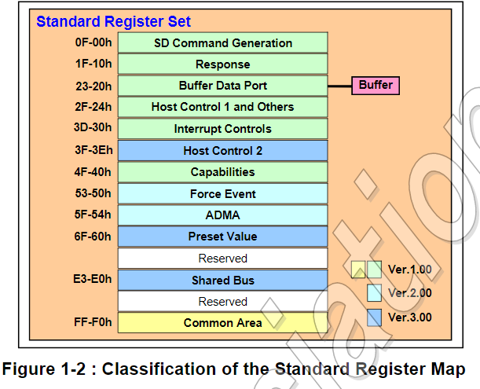

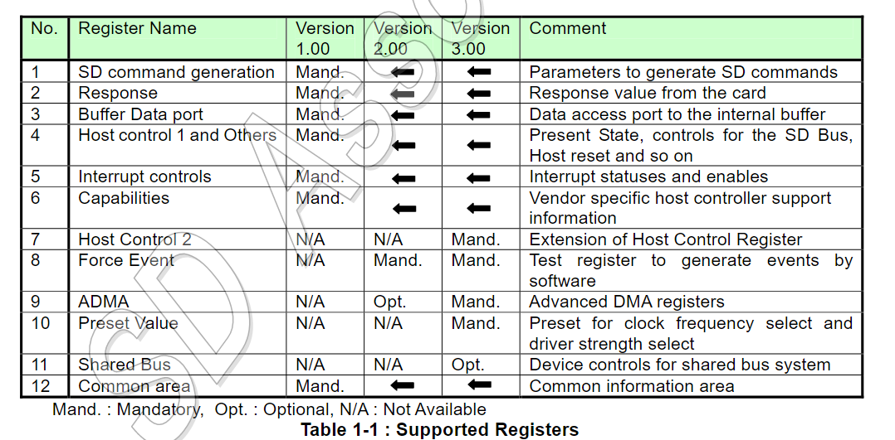

每个标准的寄存器组对应一个slot，如果控制器支持两个slot，则需要两个寄存器组。

驱动器应当决定slot的数量，以及基地址。寄存器中的 0xF0-0xFF用于控制通用的状态和slot控制。该区域可以从任何一个slot的寄存器组访问，但是访问的都是同一组寄存器。（包括slot的中断状态以及版本）

# DMA支持
控制器提供了通过编程的方式进行IO，可选地，控制器的实现者也可以支持DMA，用于DMA的算法在V1.00中描述，称为SDMA(Single Operation DMA).每个SDMA命令只能执行一条SD命令。对SDMA的支持可以通过Capabilities寄存器检测。

此版本（V3.00）提供了新的DMA算法，称为ADMA(Advanced DMA)。ADMA能够在不中断CPU的情况下进行数据传输。支持同样可以检测。

在使用DMA之前，应当确定控制器和系统总线都能支持DMA（PCI能够支持DMA）。DMA能够支持单块和多块数据传输。

驱动器可以停止和重新开始DMA操作，通过Block Gap Control寄存器。在DMA过程中，如果错误发生了，DMA操作应当停止，此时，驱动器应当通过Software Reset for DAT line来重置控制器，然后发送CMD12来停止多块的读写。（如果正在执行）

# SD命令生成
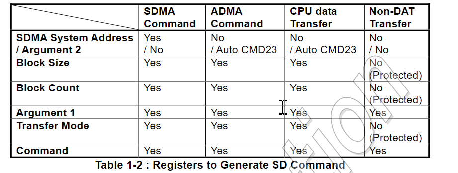

上图展示了使用各个类型的传输命令所需的寄存器。当需要发送一个命令时，驱动器应当按照0x000-0x00F的顺序依次写这些寄存器，当最后0xF的寄存器被写入时，就会产生一个命令。（最后一个字节写入即产生命令）。

驱动器在数据/命令传输期间不能读取SDMA SystemAddress,BlockSize,BlockCount寄存器，因此这些寄存器的值是不稳定的。

为了保护数据完整性，在Present State寄存器中的Command Inhibit位，当设置为1时，不能向BlockSize,BlockCount和TransferMode寄存器中写入。这种情况下， 驱动器也不应当向Argument 1和Command寄存器中写入数据。

# 操作挂起和恢复
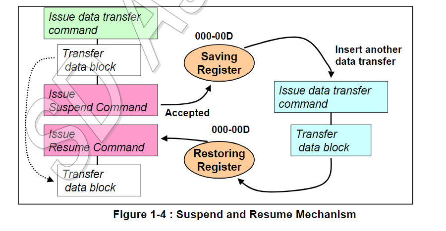
对于挂起和恢复的支持同样可以检测。

更多参见源文档

# 缓冲控制
控制器内部有一个数据缓冲区，可通过32位的数据端口获取。控制器本身维护一个读写指针，每次读或者写时，指针就会增加。注意，Buffer Data Port应当按照连续递增的顺序访问。

对于实现，应当支持不同的系统总线（8位-64位）。

缓冲区中存放至多由Block Size寄存器指定的大小的数据。驱动器通过Present State中的Buffer Write Enable（BWE）和Buffer Read Enable（BRE）两个位来决定是否读写。

当缓冲区中的数据达到BlockSize时，BWE从1变成0.意味着多余的数据不可再写。每当BWE从0变成1时，表明数据可写入，在写入一个块的数据之前，都不需要检测BWE位。

## 决定缓冲区的块长度
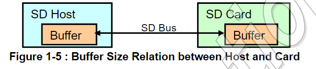

驱动器应当使用控制器和SD卡中的缓冲区块大小的最小值。控制器的缓冲区大小可从Capabilities中读取，而内存卡(Memory Card)可通过CSD读取，SDIO卡可通过CIS读取。

注：我们通常取512。为了兼容性。

## 传输大块数据
假设SDIO卡的缓冲区大小只有1个字节，并且卡不支持多块传输，则每次只能传输一个字节。
此时需要多个CMD53命令。

# 中断控制之间的关系
控制器实现了多个中断源，它们可被时限为一般的中断或者系统唤醒信号（即连接到CPU的中断引脚和唤醒引脚）。

当InterruptStatusEnable被清除时，应当清除InterruptStatus。

中断和唤醒信号的OR结果保存在Slot InterruptStatus中。

注意：系统睡眠时，驱动器应当启用唤醒信号，禁用中断；系统唤醒时，相反。但是，驱动器应当不要同时启用这两个信号。

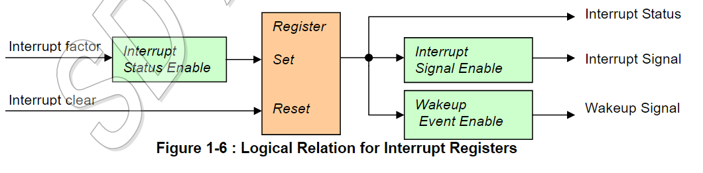

# 时钟和计时
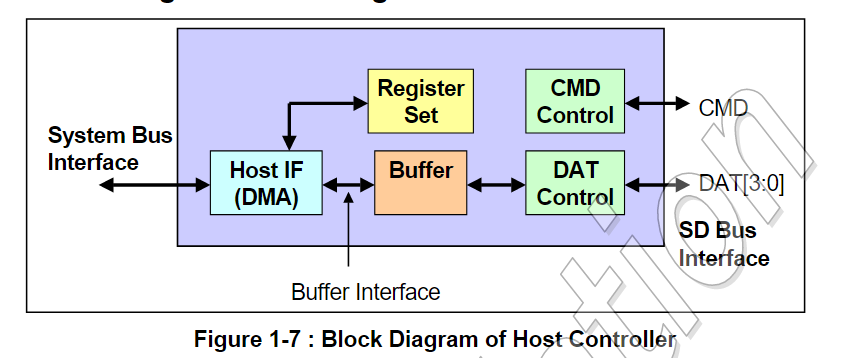

控制器拥有两个总线接口，一个是系统总线，另一个是SD总线。它们工作在不同的频率。

SD卡使用的是SD的总线，由SDCLK单独产生。

使用不同的方式传输数据应当检测的状态：
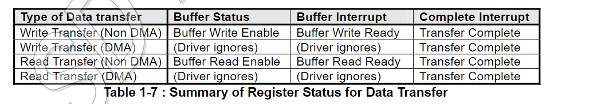

# 供电状态
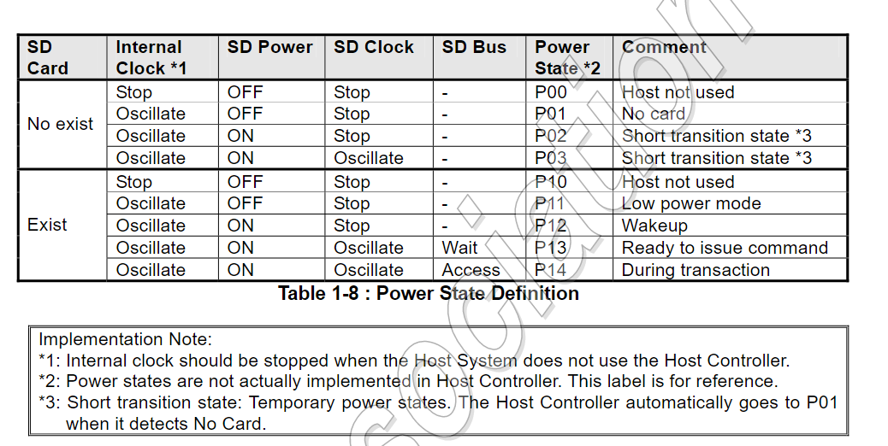

状态读取

# 自动CMD12
SD内存卡（非SDIO卡）多块传输需要CMD12来停止传输过程。控制器在最后一个块传输完后发送CMD12。这个特性被称为Auto CMD12.在传输多块数据期间， 控制器应当在TransferMode中写入Auto CMD12 Enable。

不使用DAT线传输的命令可以在多块传输之间发送，这样的命令简记为CMD_wo_DAT。

更多细节参见原技术手册1.11

# 控制SDCLK
SDCLK的周期由Clock Control的SDCLK Frequency Select设置。基础的时钟频率可从Capabilities中读取。

SDCLK由SD Bus Power控制（Power Control寄存器中），以及SD Clock Enable（Clock Control中）。
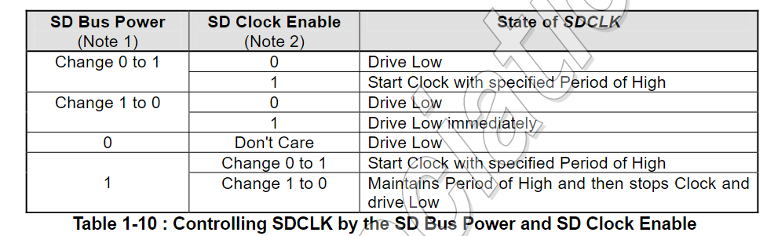

# ADMA
SDMA有一个缺点：在每个页边界会产生一个中断，这造成了SDMA的性能瓶颈。ADMA克服了这个缺陷。

有两种类型的ADMA：ADMA1和ADMA2.ADMA1只能支持4KB对齐的数据，ADMA2可以支持任意位置的任意大小的数据。

在2.00中定义了ADMA2，并将其作为标准，3.00后支持ADMA2。因此这里说的ADMA指的是ADMA2。

ADMA2的图表：
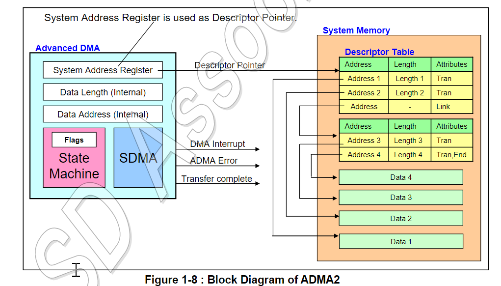

图表中的描述符表由驱动器创建。ADMA2不使用SDMA System Address 寄存器（offset0,32位），使用的是64位的ADMA System Addresss Register(0x58h)。ADMA2每次读取一个描述符，然后执行。直到所有描述符读取完毕。

地址和长度的需求： 地址的最小单位是4字节（也就是低2位必须位0）， 总长度是描述符加起来的长度，对齐到最近的BlockSize的整数倍。

当总长度不是BlockSIze的整数倍时，传输可能不会完成，这种情况下，应当通过data超时来中断传输。

Block COunt寄存器至多设置65535，如果超过65535，应当通过TransferMode中的Block Count Enable位禁用。这种情况下，总长度由描述符表决定。

描述符格式：
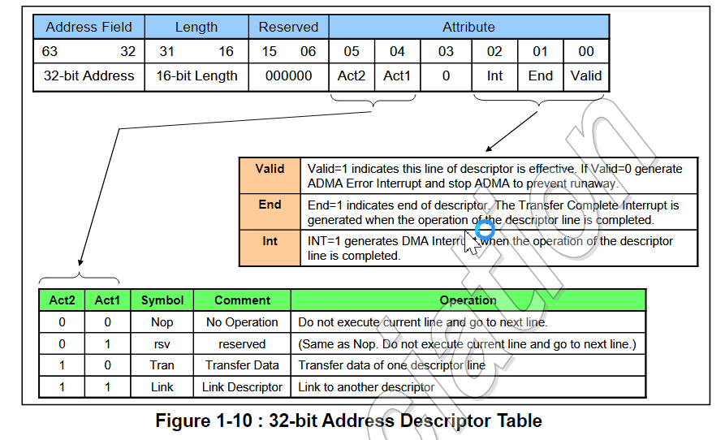

下表展示了长度域与真实长度的对应关系
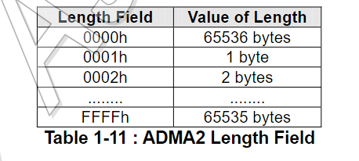

注意：这里没有描述64位系统支持的描述符，因为该描述符在4.00中会被修改。

# 测试寄存器
测试寄存器的支持是必须的。有些中断可能很难产生，通过ForceEvent寄存器可以强制产生这些终端。同样，卡插入和卡拔出的检测也是困难的，因此Card Detect Singal Selection和Card Detect Test Level（在Host Control1中）允许手动控制Card Inserted（Present State寄存器中），来产生Card Insertion和Card Removal中断（在Normal Interrupt Status寄存器中）。

# Block Count
CMD23用于设置Block Count。CMD23用于设置接下来的CMD18和CMD25的长度。

Auto CMD23是一个特性：在CMD18和CMD25之前先发送CMD23.如果支持该特性，则Argument 2(offset 0)用于CMD23的参数。ADMA和非ADMA可使用Auto CMD23，但是SDMA不使用CMD23。

下标展示了Block Count的使用：
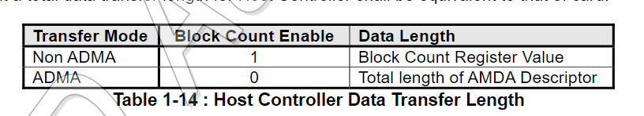
注意：在使用ADMA时，应当设置Block Count Enable=0.

# 标准寄存器

