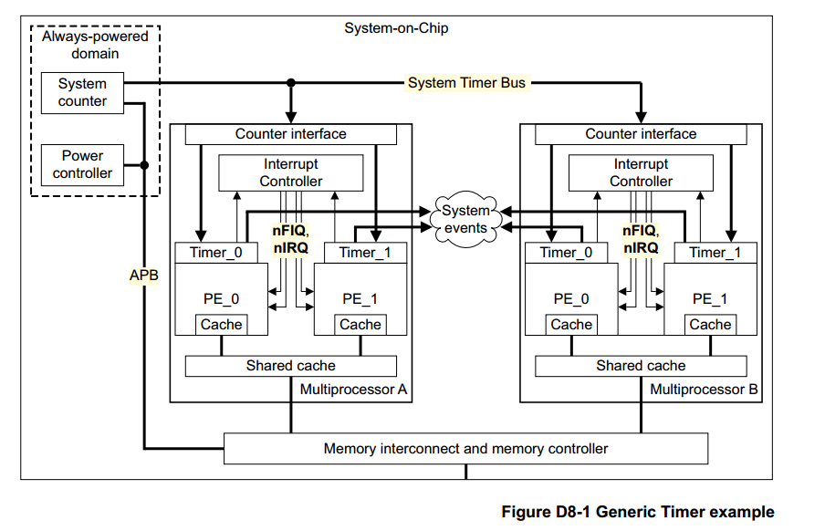

# 概述
Generic Timer分为两个部分：系统寄存器和内存映射的寄存器框架。

# 概念


上图展示的是通用计时器的一个例子。（注意， 上图并没有展示其他系统级的组件） 

通用计时器组件提供：1.一个全局通用的系统计数器  2.支持虚拟计数器，用于统计在虚拟机上流失的时间  3.计时器，可以按计数器触发中断事件

通用计时器的实现必须包含内存映射组件。

# 通用计时器的所有组件
一个系统计数器    系统级的组件由内存映射实现。
PE实现的通用计时器    每个PE实现了一组寄存器，提供下面的功能：1.一个物理计数器，能够获取系统计数器的值  2.一个虚拟计数器，获取虚拟的时间。  3.最多4个计时器，包括：EL1物理计时器  EL2物理计时器  EL3物理计时器  一个虚拟计时器


# AArch64视角的通用计时器（PE实现）
## 物理计数器
寄存器；CNTPCT_EL0 用于获取系统计数器时间。 CNTKCTL_EL1.EL0PCTEN控制该寄存器是否能从EL0访问。

注意，对CNTPCT的访问可能是随机的，在某些情况下应当使用ISB指令来保证CNTPCT的访问时序。
```
// while([R2]!=1) //等待直到条件为真
//    ;
// readCNTPCT();  // 读取
loop 
  LDR R1,[R2] 
  CMP R1,#1
  BNE loop
  ISB  // 如果没有这条指令，则MRS R1,CNTPCT可能先被执行，从而导致CNTPCT的值并不是所期望的条件下产生的值。

  MRS R1,CNTPCT
```
## 虚拟计数器
同样，系统提供的虚拟计时器CNTVCT_EL0也需要ISB。

虚拟寄存器之间的值关系： CNTVOFF_EL2 = CNTPCT_EL0 - CNTVCT_EL0

## 事件流
通用计时器可以使用系统计数器来产生多个事件流。

事件流的配置：1.选择产生事件的计数器位（从低16位选取，这决定事件的频率）  2.选择产生事件的条件（0变1或者1变0）

CNTKCTL_EL1.{EVNTEN,EVNTDIR,EVNTI}域定义从虚拟计数器产生的事件流。
CNTHCTL_EL2.{EVNTEN,EVENTDIR,EVNTI}定义从物理计数器产生的事件流。

## 计时器（最多4个）
如果与GIC连接，能够产生PPI中断。
每个计时器有一个64位的CompareValue寄存器，提供64位的向上计数器。
提供一个可选的CompareValue视角，叫做TimerValue，是32位向下计数器。
一个32位的控制寄存器。

产生中断的条件是： counter - compareValue >= 0.
中断屏蔽寄存器： CNTP_CTL_EL0, CNTHP_CTL_EL2,CNTPS_CTL_EL1, CNTV_CTL_EL0

TimerValue设置如下：
Reads:  TimerValue=(CompareValue - Counter)[31:0]
Writes:  CompareValue=(Counter + SignExtend(TimerValue))
注意Writes操作时，CompareValue是动态设置的。

当中断条件发生后，读取TimerValue的值返回的是自中断发生以后过去的时间。

TimerValue寄存器： CNTP_TVAL_EL0,CNTHP_TVAL_EL2,CNTPS_TVAL_EL1, CNTV_TVAL_EL0， CNTHV_TVAL_EL2

数据格式： 有符号的 two's complement


注意， 计时器的中断模型是通过不断地抽样检测CompareValue和CounterValue的值，如果后者大于等于前者，则发生中断。
这就是说，如果设置timerValue等于负数，则由于CompareValue = CounterValue - |timerValue|, CounterValue > CompareValue,则中断立即发生。
当中断发生以后，一般而言还会继续发生下去。大约每60000个计数之后发生下一个中断。
中断模型：
                        counter回到0
                        |         
--------^--^--^--^--^---.----^--^--^--^....
|       |  |________________
|       |_______            |
counter=0       |           |
                第一个中断   后续的中断，大约60000个计数为周期


# 内存映射的通用计时器组件
一个内存映射的计数器模块（必须）
一个内存映射的计时器控制模块（必须）
多个内存映射的计时器（可选）