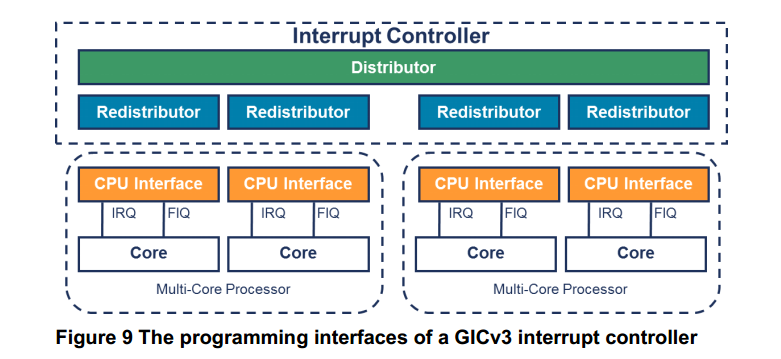
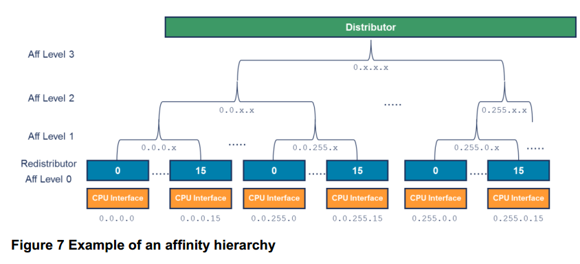
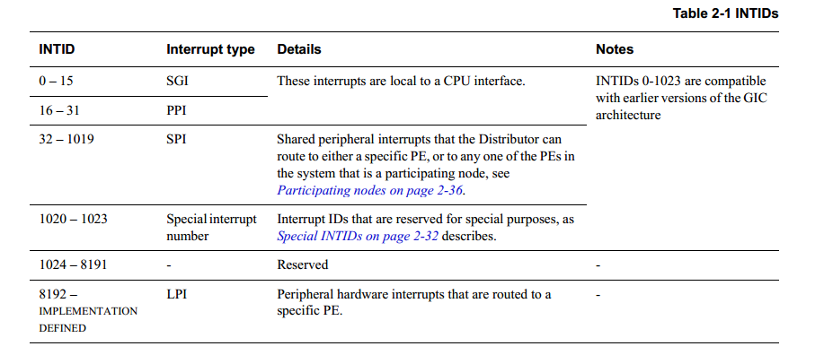
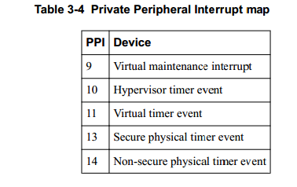
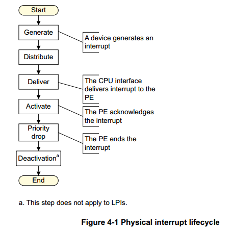
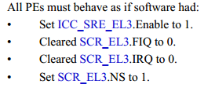
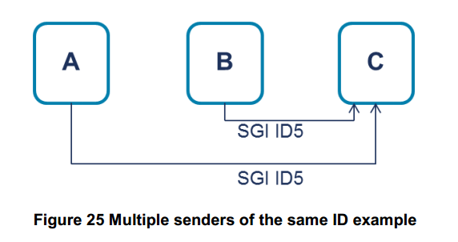
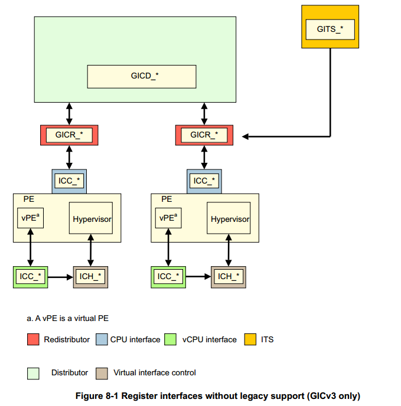

# 要点概述
中断分为几个类型：LPI，SPI，PPI，SGI等
中断控制系统具有层次结构：Distributor，Redistributor和CPU Interface。

所有的中断都具有唯一的标识符IntID， 其中， IntID0-15由SGI使用，IntID16-31由PPI使用。每种中断的产生方式都不相同。

中断具有组的概念，在只有一个安全状态的系统中，中断是两组：group0和group1。每种中断都可以配置为或者是group0，或者是group1的类型。前者对于FIQ，后者对应IRQ。

SGI中断比较特殊，它不仅可以配置，还可以在产生时指定它的group（有两个SGI寄存器）。

编程模型：CPU Interface使用系统寄存器控制， 其他的（Distributor，Redistributor）使用内存映射的寄存器。其中，Distributor是全局的，所有的PE都使用一组框架，而Redistributor则是每个PE私有的，也就是说，尽管Redistributor具有相同的内存地址，但是每个PE访问这个内存时看到的是私有的。

# 概述
本文档对ARM的通用中断控制系统版本3（GICv3）做出一个基本的描述。

GICv3相比于GICv2，能够支持更多的CPU数量，因此能够用在服务器领域。

在AArch64中，系统能够检测CPU是否支持GICv3，以此决定是否能使用某些寄存器。

中断控制系统包括3个层级部分：

其中，Distributor的寄存器框架是内存映射的，其设置将会影响到每一个连接到中断控制系统的PE。寄存器的名称是GICD_*。

对于Redistributor，它也是内存映射的，每个连接到GIC的PE都有一个对应的Redistributor，用于控制某些单个PE的中断屏蔽。注意，每个PE使用Redistributor的寄存器地址都是一样的，但是使用的只是一个副本。（所谓banked）。寄存器的名称是GICR_*。

每个Redistributor都连接到一个CPU interface，CPU接口主要用于禁用或启用某些中断， 响应中断（ACK），定义抢占策略。在GICv3中，CPU interface的寄存器是通过ICC_*_ELn来访问的。在访问这些寄存器之前，必须将ICC\_SRE\_ELn中的SRE位启用，否则不能使用这些系统寄存器。注意，在GICv2,GICv1中，这些寄存器是内存映射的，名称是GICC_*。
对于是否支持使用系统寄存器，可以通过ID_AA64PFR0_EL1来检测。

对某个PE来说， affinity值存储在MPIDR_EL1中，每8位定义affinity的一个部分，共4个。

GICv3可以支持

- 4个级别的路由层次

- 3个级别，0.b.c.d

由ICC_CTLT_EL3.A3V, ICC_CTLR_EL1.A3V和GICD_TYPER.A3V

# 中断的类型
- Locality-specific Peripheral Interrupt(LPI)
    - 在支持两个安全状态的系统中，LPI总是属于非安全的组1
    - LPIs总是边缘触发的
    - LPI可以通过ITS路由
    - LPI没有active状态，因此不需要显示的deactivation
    - LPIs总是基于消息传递的中断

- Private Peripheral Interrupt(PPI)
    - PPI可以是组0，安全组1或者非安全组1中断
    - PPI可以支持边缘触发或者电平触发
    - PPI不使用ITS路由
    - PPI用于active状态，因此需要显示的deactivation

- Shared Peripheral Interrupt(SPI)
    - SPI可以是组0，安全组1或者非安全组1中断
    - SPI可以支持两种触发方式
    - SPI不使用ITS路由
    - SPI有active状态

- Software Generated Interrupt(SGI)
    SGI通常用于处理器间的通信，其分组、触发方式、状态同SPI。

边缘触发(edge-triggered)在信号的上升沿触发。

电平触发(level-triggerd)在信号处于激活状态触发，非激活状态取消激活，由软件显式地取消。

# 中断状态
Inactive 

Pending     硬件已经识别（或者通过软件产生），等待PE处理

Active      PE已经确认了一个中断，正在处理该中断

Active and Pending    已经有一个中断处于active状态，其他的

# INTIDs空间

ARM推荐：

- 将INTID0-INTID7用作非安全的中断

- 将INTID8-INTID15作为安全中断

PPI的映射

INTID需要指定一定的大小（即用于存储INTID的位数）。

中断的生命周期

步骤如下：
1. 产生中断

2. 分发，IRI将中断分组，赋予中断的优先级，然后控制是否将中断发往CPU接口

3. 投递， CPU接口将中断传递到PE

4. Active。 PE响应了中断，GIC设置最高的激活优先级

5. 降低优先级， PE通知GIC最高优先级的中断已经处理完毕。该步可配置为同时取消激活状态

6. 取消激活状态,deactivation. 将中断的激活状态取消，因此允许其他中断被处理。

# 中断分组和安全
ARM有两个安全状态，每个安全状态有一个关联的物理地址空间。

GICD_CTLR.DS决定GIC是否支持ARMv8-A的安全模型。

如果为GICD_CTLR.DS==0
- 则GIC支持两个安全状态。
- GIC支持3个中断分组：Group0, 非安全组1
- GICR_NSACR决定SGI是否可以产生
- 安全状态在1.配置中断 2.确认中断 3.降低优先级 4.取消激活状态 时发生
- 当PE没有实现EL3时且ICC_SRE_EL1(S).SRE==0时，安全组1的中断视为组0

当GICD_CTLR.DS==1
- 只支持一个安全状态，具体取决于实现
- GIC只支持两个组：组0和组1
- SGI可以产生，忽略GICR_NSACR
- 安全状态不检查

在只支持一个安全状态，或者GICD_CTLR.DS==1时，分组如下：

GICD_CTRL.DS==1，PE具有如下行为：

# 启用中断分发
基于组
Distributor：
- GICD_CTLR.EnableGrp1,
- GICD_CTLR.EnableGrp0

CPU接口:
- ICC_IGRPEN0_EL1.Enable
- ICC_IGRPEN1_EL1.Enable

基于中断ID
- 通用部分   Distributor控制所有的中断号：GICD_ISENABLER<n>和GICD_ICENABLER<n>， n=0-31

- PPI   Distributor+通过GICR_ISENABLER0,GICR_ICENABLER0

- SPI    Distributor

- SGI     同PPI

- LPI     参见LPI配置

# 中断优先级

# GIC不同版本之间的差异

# SGI
GICv2中，每个CPU发送的SGI都是不相同的，即使它们使用相同的SGI序号。

对于GICv2来说，C将会看到两个中断，因为每个SGI的中断号需要从GICC_IAR中获取，而获取的值总是前缀CPU序号+后缀SGI数字组成，因此每个CPU发送的SGI总是不同的。

而对于GICv3而言，C只会看到一个中断，因为SGI需要没有前缀了。

# GIC的逻辑组件

ITS(Interrupt Translation Service)，用于可选地支持将事件转换成LPI。

Distributor,Redistributor和ITS共同称为IRI.

中断源和中断路由路径

- 转换成LPI的中断通过ITS到Redistributor和CPU接口

- PPI直接从source到局部的Redistributor

- SPI从source到Distributor和目标的Redistributor以及关联的CPU接口

- SGI由软件产生，通过CPU接口和Redistributor，然后从Distributor路由到其他Redistributor和CPU接口。

在GICv4中，ITS必须至少有一个实现，以便支持virtual LPI。

# 电源管理
在GICv3中，CPU接口和PE必须处于同一个电源域，但是不必与Redistributor同一个电源域。这就意味着,PE和CPU接口处于关闭状态，而Redistributor，Distributor和ITS是开启的。

在这种情况下，GIC支持通知PE一个电源开启时间。

通过GICR_WAKER.ProcessorSleep=1,在一段时间以后，GICR_WAKER.ChildrenAsleep也会设置为1.

# 编程模型

使用内存映射的寄存器和系统寄存器也许并不处于同一个状态，因此当SRE启用时，并不能保证同步。ARM推荐使用系统寄存器替代内存映射的寄存器。

