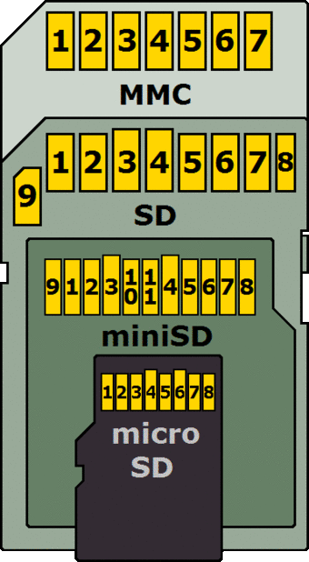
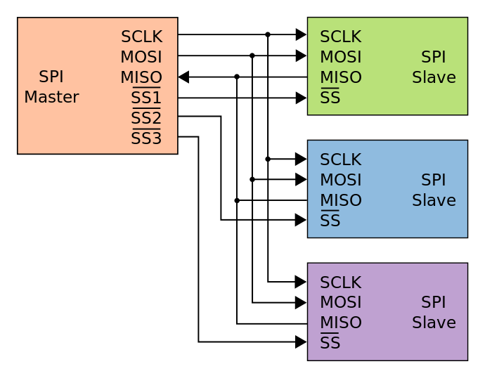

# 概念
存储卡 = 如SD卡，是flash存储
MMC = MultiMediaCard, 是用于固态存储的存储卡的标准.由一个存储器和一个控制器组成。
SecureMMC = 暂时未知，MMC 4.x推出的
eMMC = embedded MMC，与其他的标准不同，该MMC不能够被移除。

SD = Secure Digital，由SDA(SD协会)发展的面向可携带设备的存储格式。是对MMC的提升，已经成为业界标准。 安全性：可以保护数据被擦除。主机可以对SD卡设置密码，最多16字节。一个锁住的SD卡不能被写入、读取数据。

进化历程

# SD卡的命令接口(Command Interface)
SD卡和主机设备初始化时通过1个同部位进行通信。之后，主机设备发送48位的命令，然后接受响应。SD卡可以声明一个响应会延迟，但是主机可以取消一次对话。

通过不同的命令，主机可以：

1.确定类型、存储容量以及SD命令的能力

2.驱动SD卡使用不同的电压、时钟速度或者高级的电气接口

3.令SD卡准备好写入数据，或者读取数据，然后对特定的块进行回复

命令接口是MMC接口的一个扩展，SD卡取消了MMC协议中的某些命令，但也添加了与复制保护相关的命令。

通过只使用两个标准都支持的命令，主机设备可以容纳SD和MMC卡，直到需要确定插入的卡的类型。

# microSD
microSD支持SDIO模式，这就使得microSD卡槽支持非存储的操作，比如蓝牙，GPS或者近场通信。

# sdcard 家族
参见：http://www.tech-faq.com/sd-card.html
SDHC(高容量)

SDSC(标准容量)

SDXC(扩展的容量)

SDIO(组合了IO功能)

# SDIO
SDIO是对SD技术规范的扩展，覆盖了IO函数。

# SPI
Serial Peripheral Interface bus

# mmc初始化(SPI模式)
http://elm-chan.org/docs/mmc/mmc_e.html, 副本在[这里](How_to_Use_MMC_SDC.html)

# MMC v.s. SD, +SPI
https://stackoverflow.com/questions/6195099/sd-card-interfacing-using-spi

The MMC card and the SD card are flash memory storage based devices, and are physically very similar. Both card types support proprietary data transfer protocols using four data bits, and are compatible though having different initialisation. The major difference is that the SD card is designed to provide optional security by allowing encryption of the device contents. The MMC card supports additional bus widths (up to 8 bits). The SD card also supports several modes that are not present in the MMC card, including SDIO (secure digital input/output) that can be used as an external communications interface using the standard SD card format. Both card types also support a basic SPI type interface for simple connection to embedded devices. The SD card specifications state a maximum clock frequency of 25MHz, and the MMC specifications state a maximum clock frequency of 52MHz depending on the device. Figure 1 shows the MMC/SD card connections when configured for SPI mode operation.