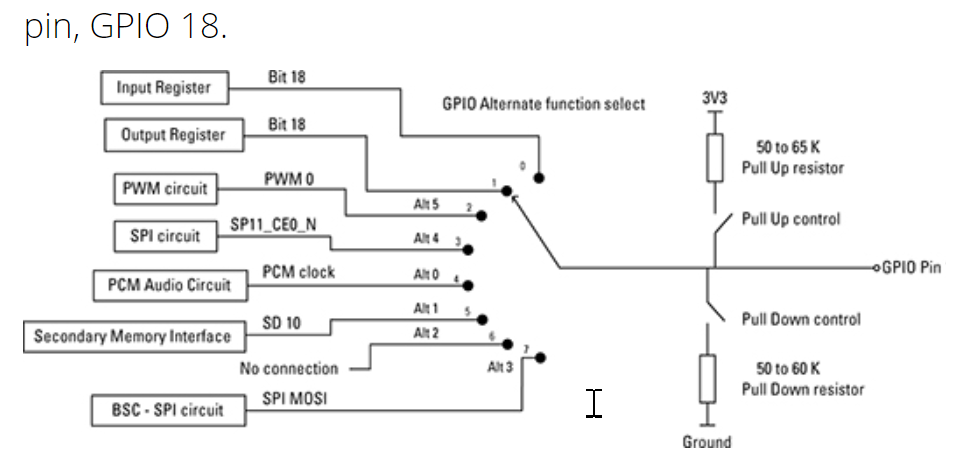

# 关于
此文件描述GPIO模块，基于BCM2835

# 概述
54个GPIO线分为两组。所有的GPIO引脚至少有两个功能（function）。

# 寄存器布局
有41个寄存器，bus基地址是0x7E20_0000, pi3中的物理地址是0x3F00_0000。

偏移 0~0x14为GPFSEL0~GPFSEL5, 每个GPFSEL能够设置10个Pin的功能。每三位一个功能。至多60个Pin。但是注意，GPFSEL5只有4个配置，因此最大值是FSEL53.

FSEL0对应的位为：GPFSEL0[0:2], 取值如下：
000 - Input
001 -Output
100 - alt0,  101 - alt1 ,  110 - alt2 , 111 - atl3, 011 - alt4, 010 - alt5

## 设置1和0，读取
通过GPSET0/1 以及 GPCLR0/1来完成。
前一个写1设置，写0无影响。当作为Input时无影响。
后一个写1清除，写0无影响。

通过GPLEV0/1来读取相应的位。该寄存器也是可写的。

# 
The Alternate function table also has the pull state which is applied after a power down

# 关于Pull down Pull Up
https://raspberrypi.stackexchange.com/questions/4569/what-is-a-pull-up-resistor-what-does-it-do-and-why-is-it-needed

简单来说， 一个输出口有三种状态：ON，OFF和FLOATING状态，然而FLOATING状态通常无用，为了使输出口处于确定的状态，为其加上一定的电压（或者减去），从而形成稳定值。

# 参考
https://pinout.xyz/

  http://www.dummies.com/computers/raspberry-pi/raspberry-pi-gpio-pin-alternate-functions/

注意，从来没有人提到这一点，但是BCM2835的GPIO映射已经改变，最好的参考是代码：
https://github.com/RPi-Distro/raspi-gpio/blob/master/raspi-gpio.c

此外，wiki：https://elinux.org/RPi_BCM2835_GPIOs

SD卡：http://blogsmayan.blogspot.co.uk/p/interfacing-sd-card.html

SPI：http://www.brianhensley.net/2012/07/getting-spi-working-on-the-raspberry-pi.html

# SD卡
https://raspberrypi.stackexchange.com/questions/38268/sdio-on-gpio-22-27-what-about-sd-card-detect?utm_medium=organic&utm_source=google_rich_qa&utm_campaign=google_rich_qa

https://www.raspberrypi.org/forums/viewtopic.php?f=98&t=88781

I'm looking in to your question now. This is what I found so far. It is not yet a complete answer, but it is far too long for a comment, so here it is.

The physical SD card slot on the Raspberry Pi is connected to GPIO pins 48 to 53. I dumped the status of these GPIO pins and determined that in normal use, these GPIOs are set to ALT3. The functions of these pins are completely undocumented.

The device tree overlay switches the function of these pins to ALT0, which is also undocumented. It also switches pins 22 to 27 to ALT3, which is documented as being SD1.

Now from the forum thread we read this:

SDIO is supported by the mmc (SD1) driver. In order to use SD1 for SDIO, you'll need to use SD0 (sdhost) for booting, as SD1 is currently being used for this. Phil has written a device tree overlay which does this.

Based on this we can infer that the default function ALT3 on GPIO 48-53 (card slot) connects those pins to SD1 (eMMC). ALT0 connects those pins to SD0 (sdhost). This frees up SD1 to be connected to GPIO 22-27 for SDIO purposes. Interestingly, GPIO 22-27 has an undocumented ALT0 function. Perhaps this connects those pins to SD0 (sdhost)?

Now the detect pin. According to the available schematics, card detect is on GPIO 47. This GPIO is not altered by the overlay, which means it will still presumably deliver any input to SD1, which is now controlling your SDIO card, as long as you have a microSD card inserted as well. So SD1 should still think there is a card inserted, because there is.

This raises the question of how SD0, now controlling the card slot, is able to detect the card. Since you are still able to boot, this suggests that the card detect signal is not really very important to the functioning of the system.

Further evidence for this comes from my dump. In normal use, this pin is set as an output, which means it isn't actually going to do anything. It is possible that the state may change if I eject the micro SD card. I can't really test that for obvious reasons.

A little more reading of the device trees and it turns out GPIO 47 is also the GPIO which controls the SD card activity LED, which explains why it's normally an output.