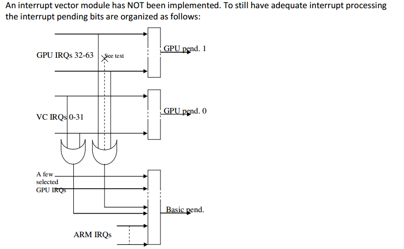
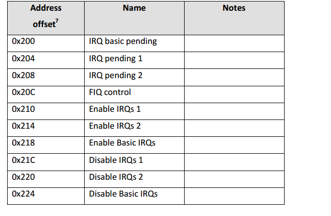
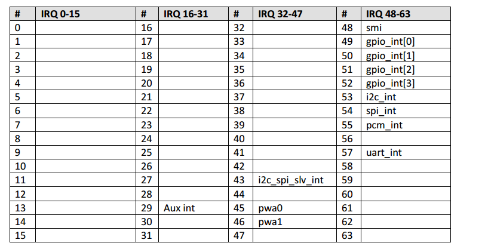
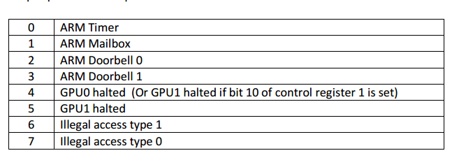
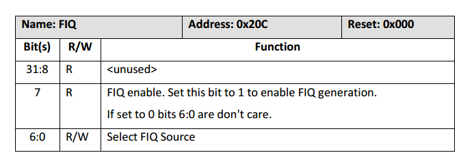
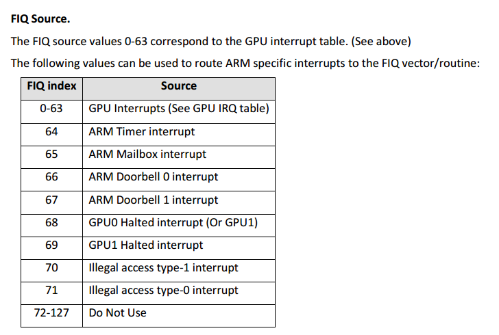

# 关于
此文件描述BCM2837的中断子系统

# 
在https://github.com/raspberrypi/linux/blob/9d2ad143e40c38d34be86578840499a976c0a5b0/arch/arm/boot/dts/bcm2837.dtsi 中， 可以看到bcm2837使用的中断子系统并不是GICvX（X=2,3,4）， 或者也不是与这些系统兼容的。

详细的pin定义dts文件参见：https://github.com/raspberrypi/firmware/blob/master/extra/dt-blob.dts

# 概述
中断有两个源:1.GPU外设  2.ARM控制的外设

ARM能够区分3中类型的中断： 1.ARM控制的外设 2.GPU外设 3.特殊的事件中断

ARM控制的中断包括： 1个计时器 1个mailbox 2个doorbell 2个GPU中断 2个地址/访问错误中断

mailbox和doorbell并不是通用的。

每个中断源都有一个相应的启用位（RW）， pending位（RO）。arm时钟产生的中断是level-sensitive的。因此所有的中断只有在禁用或者清除之后才会取消激活状态。

默认情况下，doorbell 0,1和mailbox0的中断发送到ARM意味着这些中断由GPU写入，由ARM读取。而doorbell 2,3和mailbox 1则不然。

# 中断等待响应/挂起（pending）
有三个中断挂起寄存器，包括1个基础寄存器和两个GPU寄存器。

基础寄存器包含ARM专用的中断挂起位。为了加快中断的处理，它还包括了数个GPU中断挂起位，这些挂起位基本上对于ARM驱动是必须的。此外还包括两个GPU挂起位表明两个GPU寄存器是否有中断产生（即OR的结果，OR不包括基础寄存器上的位,也就是说，处理基础寄存器上的那些位）。

# FIQ
ARM支持FIQ，也就是说，在ARM CPU的输入引脚上包括FIQ的信号线。 某个中断源可以配置为与CPU的FIQ引脚相连。同时，也有相应的FIQ启用位。当配置为FIQ时，应当将其正常的中断启用位清除，否则一个中断就会同时连接到FIQ和IRQ，这很不好。

# 中断优先级
中断没有优先级。如果中断的优先级更高，应当配置为FIQ。注意，由于中断可以发生在中断处理期间，因此必须考虑临界情况。

# 寄存器
bus基地址=0x7E00B000,物理基地址=0x3F00B000

ARM外设中断表

注意:第一个表中空白的部分不应当被启用，因为它们可能与GPU操作冲突。

## FIQ寄存器

bit6:0选择一个中断号作为FIQ连接到CPU。

因此，任何时候只有一个中断能够作为FIQ进行中断。

注意： * An interrupt must be disabled before configuring it for FIQ generation
 * otherwise both handlers will fire at the same time! 

bit6:0与中断的映射：

# 其他寄存器（与pending对应）
Interrupt disable/enable register basic/1/2

在enable寄存器中，写入1启用IRQ，其他位不受影响。

在disable寄存器中，写入1会清除相应的启用位，其他位不受影响。